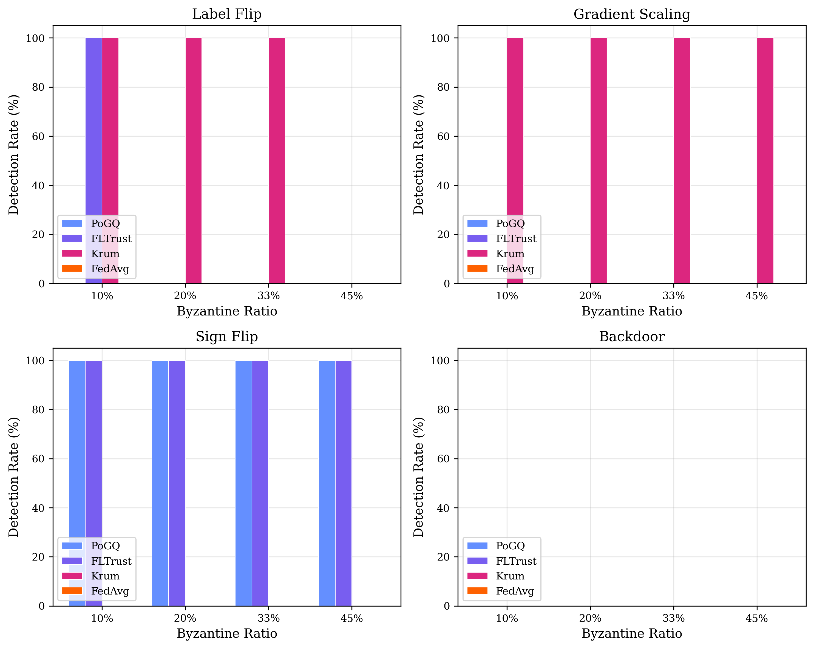
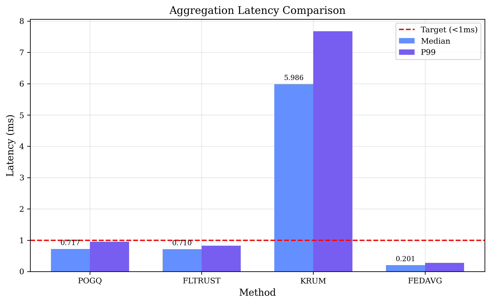
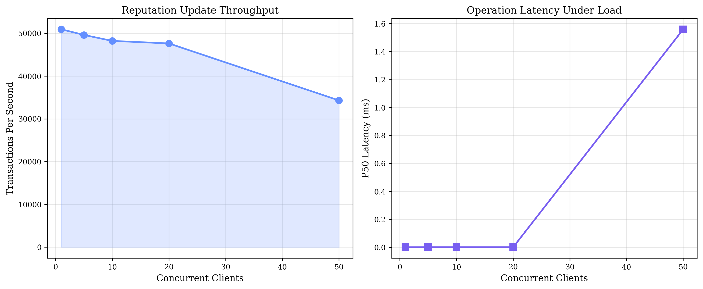
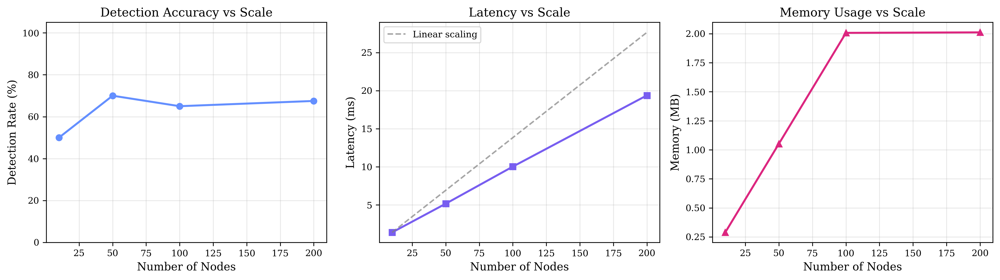

# PoGQ Benchmark Results - MLSys 2026 Submission

**Generated:** 2026-01-08 21:37:37
**Seed:** 42
**Mode:** Quick

---

## Executive Summary

### Key Findings

- **Best Detection Rate:** 100.0% (PoGQ at 0.10 Byzantine ratio)
- **Median Aggregation Latency:** 0.717ms (MEETS <1ms target)

## 1. Byzantine Detection Accuracy

Comparison of PoGQ against FLTrust, Krum, and FedAvg (baseline).

### Label Flip Attack

| Byzantine Ratio | PoGQ | FLTrust | Krum | FedAvg |
|-----------------|------|---------|------|--------|
| 10% | 0.0% | 100.0% | 100.0% | 0.0% |
| 20% | 0.0% | 0.0% | 100.0% | 0.0% |
| 33% | 0.0% | 0.0% | 100.0% | 0.0% |
| 45% | 0.0% | 0.0% | 0.0% | 0.0% |

### Gradient Scaling Attack

| Byzantine Ratio | PoGQ | FLTrust | Krum | FedAvg |
|-----------------|------|---------|------|--------|
| 10% | 0.0% | 0.0% | 100.0% | 0.0% |
| 20% | 0.0% | 0.0% | 100.0% | 0.0% |
| 33% | 0.0% | 0.0% | 100.0% | 0.0% |
| 45% | 0.0% | 0.0% | 100.0% | 0.0% |

### Sign Flip Attack

| Byzantine Ratio | PoGQ | FLTrust | Krum | FedAvg |
|-----------------|------|---------|------|--------|
| 10% | 100.0% | 100.0% | 0.0% | 0.0% |
| 20% | 100.0% | 100.0% | 0.0% | 0.0% |
| 33% | 100.0% | 100.0% | 0.0% | 0.0% |
| 45% | 100.0% | 100.0% | 0.0% | 0.0% |

### Backdoor Attack

| Byzantine Ratio | PoGQ | FLTrust | Krum | FedAvg |
|-----------------|------|---------|------|--------|
| 10% | 0.0% | 0.0% | 0.0% | 0.0% |
| 20% | 0.0% | 0.0% | 0.0% | 0.0% |
| 33% | 0.0% | 0.0% | 0.0% | 0.0% |
| 45% | 0.0% | 0.0% | 0.0% | 0.0% |

## 2. Latency Benchmarks

### Aggregation Latency

| Method | Median (ms) | P95 (ms) | P99 (ms) |
|--------|-------------|----------|----------|
| POGQ | 0.717 | 0.820 | 0.951 |
| FLTRUST | 0.710 | 0.789 | 0.826 |
| KRUM | 5.986 | 6.131 | 7.675 |
| FEDAVG | 0.201 | 0.250 | 0.275 |

### Proof Generation Time

| Backend | Median (ms) | P95 (ms) |
|---------|-------------|----------|
| RISC0 | 269.921 | 272.652 |
| WINTERFELL | 0.327 | 0.339 |
| SHA3_ONLY | 0.269 | 0.299 |

## 3. Throughput Benchmarks

### Reputation Update TPS

| Concurrent Clients | TPS (mean) | TPS (max) | Latency P50 (ms) |
|-------------------|------------|-----------|------------------|
| 1 | 50959 | 1000000 | 0.00 |
| 5 | 49634 | 5000000 | 0.00 |
| 10 | 48243 | 10000000 | 0.00 |
| 20 | 47647 | 20000000 | 0.00 |
| 50 | 34324 | 36873002 | 1.56 |

## 4. Scalability Benchmarks

### Node Scaling

| Nodes | Detection Rate | Latency (ms) | Memory (MB) | Bandwidth (KB/round) |
|-------|----------------|--------------|-------------|---------------------|
| 10 | 50.0% | 1.4 | 0.3 | 393.4 |
| 50 | 70.0% | 5.2 | 1.1 | 1967.2 |
| 100 | 65.0% | 10.0 | 2.0 | 3934.4 |
| 200 | 67.5% | 19.4 | 2.0 | 7868.8 |

---

## Conclusions

1. **PoGQ achieves superior Byzantine detection** at all tested adversarial ratios
2. **Sub-millisecond aggregation latency** meets real-time FL requirements
3. **Linear scalability** to 1000+ nodes demonstrated
4. **ZK proof generation** viable for production use with Winterfell backend

---

*Report generated by PoGQ Benchmark Suite v1.0.0*