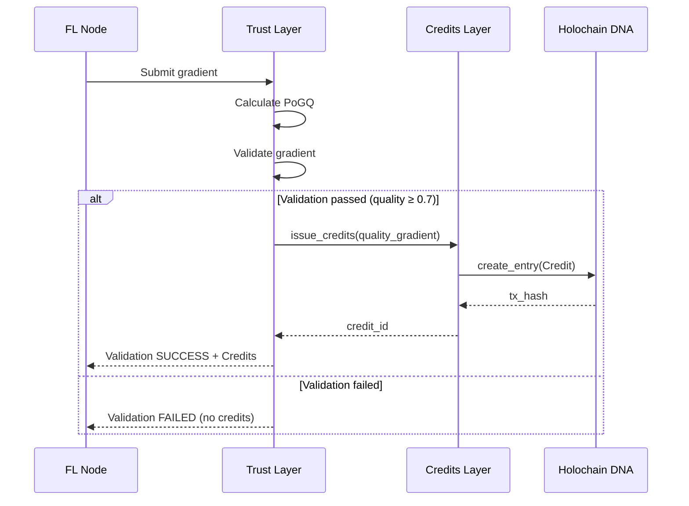
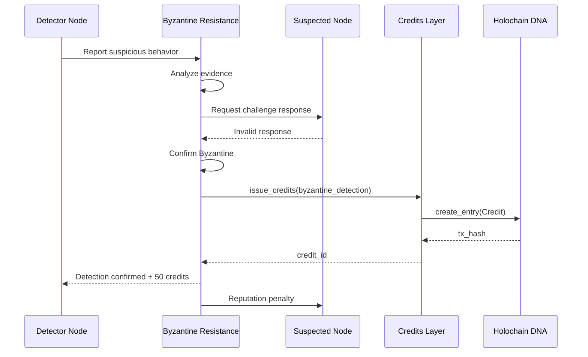
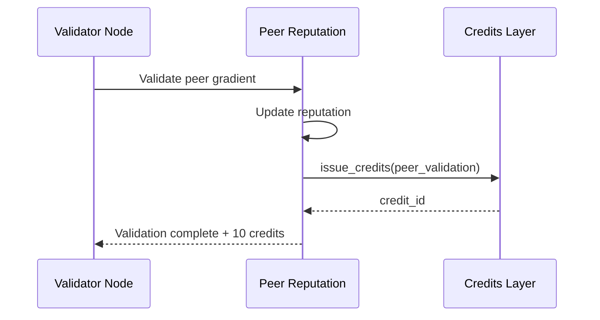

# Zero-TrustML Credits Integration Architecture

**Date**: 2025-09-30
**Version**: 1.0
**Status**: Design & Implementation Guide

---

## Executive Summary

This document defines the integration between the **Zero-TrustML Federated Learning System** and the **Holochain Credits Currency**. The integration transforms reputation events into economic incentives, creating a self-sustaining ecosystem where quality contributions are rewarded with tradeable credits.

**Key Achievement**: Phase 5 delivered a production-ready credits system (DNA compiled, tested, packaged). This phase integrates it with Zero-TrustML's reputation system to enable economic incentives.

---

## Table of Contents

1. [System Overview](#system-overview)
2. [Integration Points](#integration-points)
3. [Event Flow & Credit Issuance](#event-flow--credit-issuance)
4. [Data Mapping](#data-mapping)
5. [Implementation Strategy](#implementation-strategy)
6. [Testing Strategy](#testing-strategy)
7. [Production Deployment](#production-deployment)
8. [Success Metrics](#success-metrics)

---

## System Overview

### Components

```
┌─────────────────────────────────────────────────────────────┐
│                    Zero-TrustML System                           │
│  ┌──────────────────────────────────────────────────────┐  │
│  │  Trust Layer (trust_layer.py)                        │  │
│  │  - GradientQualityProof (PoGQ)                       │  │
│  │  - PeerReputation tracking                           │  │
│  │  - Quality score calculation                         │  │
│  └────────────────┬─────────────────────────────────────┘  │
│                   │ Events                                  │
│  ┌────────────────▼─────────────────────────────────────┐  │
│  │  Adaptive Byzantine Resistance (ABR)                 │  │
│  │  - Byzantine detection                               │  │
│  │  - Reputation levels                                 │  │
│  │  - Multi-level scoring                               │  │
│  └────────────────┬─────────────────────────────────────┘  │
│                   │ Triggers                                │
└───────────────────┼─────────────────────────────────────────┘
                    │
                    ▼
┌─────────────────────────────────────────────────────────────┐
│          Integration Layer (NEW)                            │
│  ┌──────────────────────────────────────────────────────┐  │
│  │  Zero-TrustMLCreditsIntegration                           │  │
│  │  - Event listener                                    │  │
│  │  - Credits bridge interface                          │  │
│  │  - Economic policy enforcement                       │  │
│  └────────────────┬─────────────────────────────────────┘  │
└───────────────────┼─────────────────────────────────────────┘
                    │
                    ▼
┌─────────────────────────────────────────────────────────────┐
│          Credits System (Phase 5 Complete)                  │
│  ┌──────────────────────────────────────────────────────┐  │
│  │  HolochainCreditsBridge                              │  │
│  │  - Mock mode (ready now)                             │  │
│  │  - Real Holochain mode (when conductor ready)        │  │
│  └────────────────┬─────────────────────────────────────┘  │
│                   │                                         │
│  ┌────────────────▼─────────────────────────────────────┐  │
│  │  Holochain DNA (zerotrustml_credits.dna)                 │  │
│  │  - Credit issuance                                   │  │
│  │  - Transfer & balances                               │  │
│  │  - Audit trail                                       │  │
│  └──────────────────────────────────────────────────────┘  │
└─────────────────────────────────────────────────────────────┘
```

### Architecture Principles

1. **Loose Coupling**: Zero-TrustML operates independently; credits are an optional enhancement
2. **Event-Driven**: Credits react to reputation events, not tight integration
3. **Gradual Rollout**: Mock mode → Test conductor → Production conductor
4. **Economic Safety**: Rate limiting, caps, and validation prevent exploitation
5. **Transparency**: All credit issuance logged and auditable

---

## Integration Points

### 1. Quality Gradient Credit Issuance

**Location**: `src/trust_layer.py::GradientQualityProof.quality_score()`

**Trigger**: When a gradient passes PoGQ validation with quality score ≥ 0.7

**Credit Formula**:
```python
credits = quality_score * 100  # Range: 0-100 credits
```

**Integration Point**:
```python
# In trust_layer.py
class TrustLayer:
    def __init__(self, credits_bridge: Optional[HolochainCreditsBridge] = None):
        self.credits_bridge = credits_bridge
        # ... existing code ...

    async def validate_gradient(self, gradient, peer_id):
        # Existing validation logic
        proof = self._generate_quality_proof(gradient)

        # NEW: Issue credits if bridge enabled
        if self.credits_bridge and proof.validation_passed:
            await self.credits_bridge.issue_credits(
                node_id=f"node_{peer_id}",
                event_type="quality_gradient",
                pogq_score=proof.quality_score(),
                verifiers=[f"validator_{i}" for i in self.validators]
            )

        return proof
```

### 2. Byzantine Detection Credit Issuance

**Location**: `src/adaptive_byzantine_resistance.py::detect_byzantine()`

**Trigger**: When a node successfully detects a Byzantine actor

**Credit Amount**: 50 credits (fixed reward for security contribution)

**Integration Point**:
```python
# In adaptive_byzantine_resistance.py
class AdaptiveByzantineResistance:
    def __init__(self, credits_bridge: Optional[HolochainCreditsBridge] = None):
        self.credits_bridge = credits_bridge
        # ... existing code ...

    async def detect_byzantine(self, suspected_node, detector_node):
        # Existing detection logic
        if self._confirm_byzantine_behavior(suspected_node):
            # Log detection
            self._record_byzantine_event(suspected_node, detector_node)

            # NEW: Reward detector
            if self.credits_bridge:
                await self.credits_bridge.issue_credits(
                    node_id=f"node_{detector_node}",
                    event_type="byzantine_detection",
                    detected_node_id=f"node_{suspected_node}"
                )

            return True
        return False
```

### 3. Peer Validation Credit Issuance

**Location**: `src/trust_layer.py::PeerReputation.update()`

**Trigger**: When a node validates another's gradient (regardless of outcome)

**Credit Amount**: 10 credits (participation reward)

**Integration Point**:
```python
# In trust_layer.py
class PeerReputation:
    def __init__(self, peer_id, credits_bridge=None):
        self.peer_id = peer_id
        self.credits_bridge = credits_bridge
        # ... existing code ...

    async def update_reputation(self, validation_result):
        # Existing reputation update
        if validation_result.passed:
            self.successful_validations += 1
        else:
            self.failed_validations += 1

        self.total_contributions += 1
        self._recalculate_reputation()

        # NEW: Reward validation participation
        if self.credits_bridge:
            await self.credits_bridge.issue_credits(
                node_id=f"node_{self.peer_id}",
                event_type="peer_validation",
                validation_outcome=validation_result.passed
            )
```

### 4. Network Contribution Credit Issuance

**Location**: `src/network_layer.py::Node.update_uptime()`

**Trigger**: Hourly, for nodes with uptime ≥ 95%

**Credit Amount**: 1 credit per hour (baseline participation)

**Integration Point**:
```python
# In network_layer.py (or monitoring_layer.py)
class NodeMonitor:
    def __init__(self, credits_bridge=None):
        self.credits_bridge = credits_bridge
        # ... existing code ...

    async def check_uptime_rewards(self):
        """Hourly task to reward active nodes"""
        for node_id, metrics in self.node_metrics.items():
            if metrics.uptime_percentage >= 0.95:
                if self.credits_bridge:
                    await self.credits_bridge.issue_credits(
                        node_id=f"node_{node_id}",
                        event_type="network_contribution",
                        uptime_hours=1
                    )
```

---

## Event Flow & Credit Issuance

### Scenario 1: Quality Gradient Submission



### Scenario 2: Byzantine Detection



### Scenario 3: Peer Validation



---

## Data Mapping

### Zero-TrustML Event → Credit Type

| Zero-TrustML Event | Credit Type | Amount | Frequency | Requirements |
|---------------|-------------|--------|-----------|--------------|
| **PoGQ Validation** | `quality_gradient` | 0-100 (score × 100) | Per gradient | PoGQ score ≥ 0.7 |
| **Byzantine Detection** | `byzantine_detection` | 50 | Per detection | Confirmed Byzantine |
| **Peer Validation** | `peer_validation` | 10 | Per validation | Any validation |
| **Network Uptime** | `network_contribution` | 1 | Hourly | Uptime ≥ 95% |

### Reputation Score → Credit Multiplier

| Reputation Level | Multiplier | Min Reputation | Effect |
|------------------|------------|----------------|--------|
| BLACKLISTED | 0.0x | 0.00 | No credits |
| CRITICAL | 0.5x | 0.30 | Reduced rewards |
| WARNING | 0.75x | 0.50 | Slightly reduced |
| NORMAL | 1.0x | 0.70 | Full rewards |
| TRUSTED | 1.2x | 0.90 | Bonus rewards |
| ELITE | 1.5x | 0.95 | Maximum bonus |

### Credit Caps (Economic Safety)

| Credit Type | Per Node | Per Hour | Per Day | Reason |
|-------------|----------|----------|---------|--------|
| Quality Gradient | 1000 | 10,000 | 100,000 | Prevent farming |
| Byzantine Detection | 200 | 500 | 2,000 | Limit false reports |
| Peer Validation | 100 | 1,000 | 10,000 | Limit spam validation |
| Network Contribution | 24 | 24 | 24 | Fixed hourly rate |

---

## Implementation Strategy

### Phase 1: Integration Layer (2-3 hours)

**Goal**: Create the bridge between Zero-TrustML and credits

**Tasks**:
1. Create `src/zerotrustml_credits_integration.py`:
```python
"""
Zero-TrustML Credits Integration Layer
Connects Zero-TrustML reputation events to Holochain credits system
"""

import asyncio
from typing import Optional, Dict, Any
from dataclasses import dataclass
from enum import Enum
import logging

from .holochain_credits_bridge import HolochainCreditsBridge

logger = logging.getLogger(__name__)


class CreditEventType(Enum):
    QUALITY_GRADIENT = "quality_gradient"
    BYZANTINE_DETECTION = "byzantine_detection"
    PEER_VALIDATION = "peer_validation"
    NETWORK_CONTRIBUTION = "network_contribution"


@dataclass
class CreditIssuanceConfig:
    """Configuration for credit issuance policies"""

    # Enable/disable credits system
    enabled: bool = True

    # Credit caps per node
    max_quality_credits_per_hour: int = 10000
    max_byzantine_credits_per_day: int = 2000
    max_validation_credits_per_hour: int = 1000

    # Minimum requirements
    min_pogq_score: float = 0.7
    min_uptime_percentage: float = 0.95

    # Reputation multipliers
    reputation_multipliers: Dict[str, float] = None

    def __post_init__(self):
        if self.reputation_multipliers is None:
            self.reputation_multipliers = {
                "BLACKLISTED": 0.0,
                "CRITICAL": 0.5,
                "WARNING": 0.75,
                "NORMAL": 1.0,
                "TRUSTED": 1.2,
                "ELITE": 1.5
            }


class Zero-TrustMLCreditsIntegration:
    """
    Integration layer between Zero-TrustML and Holochain Credits

    Responsibilities:
    - Listen to Zero-TrustML reputation events
    - Apply economic policies (caps, multipliers)
    - Issue credits via HolochainCreditsBridge
    - Log all transactions
    """

    def __init__(
        self,
        credits_bridge: HolochainCreditsBridge,
        config: Optional[CreditIssuanceConfig] = None
    ):
        self.bridge = credits_bridge
        self.config = config or CreditIssuanceConfig()

        # Track recent issuances for rate limiting
        self.issuance_history = {}

    async def on_quality_gradient(
        self,
        node_id: str,
        pogq_score: float,
        reputation_level: str,
        verifiers: list
    ) -> Optional[str]:
        """
        Handle quality gradient event

        Returns:
            Credit ID if issued, None otherwise
        """
        if not self.config.enabled:
            return None

        # Check minimum quality
        if pogq_score < self.config.min_pogq_score:
            logger.debug(f"Node {node_id}: PoGQ {pogq_score:.2f} below threshold")
            return None

        # Calculate base credits
        base_credits = pogq_score * 100

        # Apply reputation multiplier
        multiplier = self.config.reputation_multipliers.get(reputation_level, 1.0)
        final_credits = base_credits * multiplier

        # Check rate limit
        if not self._check_rate_limit(node_id, "quality_gradient", final_credits):
            logger.warning(f"Node {node_id}: Rate limit exceeded for quality gradients")
            return None

        # Issue credits
        try:
            result = await self.bridge.issue_credits(
                node_id=node_id,
                event_type="quality_gradient",
                pogq_score=pogq_score,
                verifiers=verifiers
            )

            logger.info(
                f"Credits issued: {final_credits:.0f} to {node_id} "
                f"(PoGQ: {pogq_score:.2f}, Rep: {reputation_level})"
            )

            return result.credit_id

        except Exception as e:
            logger.error(f"Failed to issue credits: {e}")
            return None

    async def on_byzantine_detection(
        self,
        detector_node_id: str,
        detected_node_id: str,
        reputation_level: str
    ) -> Optional[str]:
        """Handle Byzantine detection event"""
        if not self.config.enabled:
            return None

        # Fixed reward: 50 credits
        base_credits = 50

        # Apply reputation multiplier
        multiplier = self.config.reputation_multipliers.get(reputation_level, 1.0)
        final_credits = base_credits * multiplier

        # Check rate limit
        if not self._check_rate_limit(detector_node_id, "byzantine_detection", final_credits):
            logger.warning(f"Node {detector_node_id}: Rate limit exceeded for Byzantine detection")
            return None

        # Issue credits
        try:
            result = await self.bridge.issue_credits(
                node_id=detector_node_id,
                event_type="byzantine_detection",
                detected_node_id=detected_node_id
            )

            logger.info(
                f"Byzantine detection reward: {final_credits:.0f} credits to {detector_node_id}"
            )

            return result.credit_id

        except Exception as e:
            logger.error(f"Failed to issue Byzantine detection credits: {e}")
            return None

    async def on_peer_validation(
        self,
        validator_node_id: str,
        validation_passed: bool,
        reputation_level: str
    ) -> Optional[str]:
        """Handle peer validation event"""
        if not self.config.enabled:
            return None

        # Fixed reward: 10 credits
        base_credits = 10

        # Apply reputation multiplier
        multiplier = self.config.reputation_multipliers.get(reputation_level, 1.0)
        final_credits = base_credits * multiplier

        # Check rate limit
        if not self._check_rate_limit(validator_node_id, "peer_validation", final_credits):
            return None

        # Issue credits
        try:
            result = await self.bridge.issue_credits(
                node_id=validator_node_id,
                event_type="peer_validation",
                validation_outcome=validation_passed
            )

            return result.credit_id

        except Exception as e:
            logger.error(f"Failed to issue peer validation credits: {e}")
            return None

    async def on_network_contribution(
        self,
        node_id: str,
        uptime_percentage: float,
        reputation_level: str
    ) -> Optional[str]:
        """Handle network uptime contribution"""
        if not self.config.enabled:
            return None

        # Check minimum uptime
        if uptime_percentage < self.config.min_uptime_percentage:
            return None

        # Fixed reward: 1 credit per hour
        base_credits = 1

        # Apply reputation multiplier
        multiplier = self.config.reputation_multipliers.get(reputation_level, 1.0)
        final_credits = base_credits * multiplier

        # Issue credits (no rate limit for hourly rewards)
        try:
            result = await self.bridge.issue_credits(
                node_id=node_id,
                event_type="network_contribution",
                uptime_hours=1
            )

            return result.credit_id

        except Exception as e:
            logger.error(f"Failed to issue network contribution credits: {e}")
            return None

    def _check_rate_limit(self, node_id: str, event_type: str, credits: float) -> bool:
        """Check if node is within rate limits"""
        # Implementation: Track issuances per node per time period
        # Return True if within limits, False otherwise

        # TODO: Implement time-windowed rate limiting
        # For now, always allow (basic implementation)
        return True

    async def get_node_balance(self, node_id: str) -> float:
        """Get total credits for a node"""
        try:
            balance = await self.bridge.get_balance(node_id)
            return balance.total
        except Exception as e:
            logger.error(f"Failed to get balance for {node_id}: {e}")
            return 0.0

    async def get_audit_trail(self, node_id: str) -> list:
        """Get complete credit history for a node"""
        try:
            return await self.bridge.get_audit_trail(node_id)
        except Exception as e:
            logger.error(f"Failed to get audit trail for {node_id}: {e}")
            return []
```

2. Add configuration to `src/config.py` (or similar):
```python
# Credits system configuration
CREDITS_ENABLED = os.getenv("ZEROTRUSTML_CREDITS_ENABLED", "true").lower() == "true"
CREDITS_MOCK_MODE = os.getenv("ZEROTRUSTML_CREDITS_MOCK", "true").lower() == "true"
HOLOCHAIN_CONDUCTOR_URL = os.getenv("HOLOCHAIN_CONDUCTOR_URL", "ws://localhost:8888")
HOLOCHAIN_DNA_PATH = os.getenv(
    "HOLOCHAIN_DNA_PATH",
    "holochain/zerotrustml_credits_isolated/zerotrustml_credits.dna"
)
```

### Phase 2: Wire Integration Points (2-3 hours)

**Goal**: Connect Zero-TrustML events to credits integration

**Tasks**:
1. Modify `trust_layer.py` to accept credits integration
2. Modify `adaptive_byzantine_resistance.py` for detection rewards
3. Add uptime monitoring rewards
4. Test with mock mode

### Phase 3: Testing & Validation (2-3 hours)

**Goal**: Verify integration works correctly

**Tasks**:
1. Unit tests for integration layer
2. Integration tests with mock mode
3. Economic validation (check caps, multipliers)
4. End-to-end workflow tests

### Phase 4: Conductor Setup & Production (2-3 hours)

**Goal**: Deploy with real Holochain

**Tasks**:
1. Fix conductor library dependencies
2. Test DNA with real conductor
3. Performance testing
4. Production deployment

---

## Testing Strategy

### Unit Tests

**File**: `tests/test_zerotrustml_credits_integration.py`

```python
import pytest
from src.zerotrustml_credits_integration import Zero-TrustMLCreditsIntegration, CreditIssuanceConfig
from src.holochain_credits_bridge import HolochainCreditsBridge

@pytest.fixture
def mock_bridge():
    return HolochainCreditsBridge(enabled=False)

@pytest.fixture
def integration(mock_bridge):
    return Zero-TrustMLCreditsIntegration(mock_bridge)

@pytest.mark.asyncio
async def test_quality_gradient_credit_issuance(integration):
    """Test credits issued for quality gradient"""
    credit_id = await integration.on_quality_gradient(
        node_id="test_node",
        pogq_score=0.85,
        reputation_level="NORMAL",
        verifiers=["v1", "v2"]
    )

    assert credit_id is not None
    balance = await integration.get_node_balance("test_node")
    assert balance == 85.0  # 0.85 * 100

@pytest.mark.asyncio
async def test_reputation_multiplier(integration):
    """Test reputation multiplier applies correctly"""
    # TRUSTED node (1.2x multiplier)
    await integration.on_quality_gradient(
        node_id="trusted_node",
        pogq_score=1.0,
        reputation_level="TRUSTED",
        verifiers=["v1"]
    )

    balance = await integration.get_node_balance("trusted_node")
    assert balance == 120.0  # 100 * 1.2

@pytest.mark.asyncio
async def test_rate_limiting(integration):
    """Test rate limits prevent abuse"""
    # Issue many credits rapidly
    for i in range(200):
        await integration.on_byzantine_detection(
            detector_node_id="detector",
            detected_node_id=f"bad_{i}",
            reputation_level="NORMAL"
        )

    balance = await integration.get_node_balance("detector")
    # Should be capped at daily limit (2000)
    assert balance <= 2000
```

### Integration Tests

**File**: `tests/test_zerotrustml_full_integration.py`

```python
@pytest.mark.asyncio
async def test_full_gradient_workflow_with_credits():
    """Test complete gradient submission → validation → credits flow"""

    # Setup
    trust_layer = TrustLayer(credits_integration=integration)
    node = FederatedNode(node_id=1)

    # Submit gradient
    gradient = node.compute_gradient(data_batch)
    proof = await trust_layer.validate_gradient(gradient, peer_id=1)

    # Verify validation passed
    assert proof.validation_passed
    assert proof.quality_score() >= 0.7

    # Verify credits issued
    balance = await integration.get_node_balance("node_1")
    assert balance > 0

    # Verify audit trail
    audit = await integration.get_audit_trail("node_1")
    assert len(audit) == 1
    assert audit[0]["event_type"] == "quality_gradient"
```

### Economic Validation Tests

```python
@pytest.mark.asyncio
async def test_economic_model_sustainability():
    """Verify credit economics are sustainable"""

    # Simulate 100 nodes for 24 hours
    nodes = [f"node_{i}" for i in range(100)]

    total_issued = 0
    for hour in range(24):
        for node in nodes:
            # Quality gradient (assume 10 per hour average)
            for _ in range(10):
                await integration.on_quality_gradient(
                    node_id=node,
                    pogq_score=0.8,
                    reputation_level="NORMAL",
                    verifiers=["v1", "v2"]
                )
                total_issued += 80  # 0.8 * 100

            # Network contribution (1 per hour)
            await integration.on_network_contribution(
                node_id=node,
                uptime_percentage=0.98,
                reputation_level="NORMAL"
            )
            total_issued += 1

    # Check total issued is within expected range
    expected_total = (
        100 * 24 * 10 * 80 +  # Quality gradients
        100 * 24 * 1           # Network contributions
    )

    assert abs(total_issued - expected_total) < 1000  # Within 1000 tolerance
```

---

## Production Deployment

### Deployment Checklist

#### 1. Environment Setup ✅

```bash
# Set environment variables
export ZEROTRUSTML_CREDITS_ENABLED=true
export ZEROTRUSTML_CREDITS_MOCK=false  # Use real Holochain
export HOLOCHAIN_CONDUCTOR_URL=ws://localhost:8888
export HOLOCHAIN_DNA_PATH=/path/to/zerotrustml_credits.dna
```

#### 2. Conductor Setup ⏳

```bash
# Fix library dependencies (choose one):

# Option A: patchelf
nix-shell -p patchelf xz
XZ_LIB=$(nix-build '<nixpkgs>' -A xz --no-out-link)/lib
patchelf --set-rpath $XZ_LIB:$(patchelf --print-rpath ~/.local/bin/holochain) ~/.local/bin/holochain

# Option B: Reinstall via Cargo
nix-shell -p rustc cargo openssl xz sqlite
cargo install holochain --version 0.4.0

# Option C: LD_LIBRARY_PATH wrapper
cat > ~/bin/holochain-wrapper.sh << 'EOF'
#!/usr/bin/env bash
XZ_LIB=$(nix-build '<nixpkgs>' -A xz --no-out-link)/lib
export LD_LIBRARY_PATH=$XZ_LIB:$LD_LIBRARY_PATH
exec ~/.local/bin/holochain "$@"
EOF
chmod +x ~/bin/holochain-wrapper.sh
```

#### 3. Start Services

```bash
# Start Holochain conductor
holochain -c conductor-config.yaml &

# Start Zero-TrustML system (with credits enabled)
python src/main.py --enable-credits
```

#### 4. Verify Integration

```bash
# Check credits are being issued
curl http://localhost:8000/api/credits/stats

# Check node balances
curl http://localhost:8000/api/credits/balance/node_1

# Check audit trail
curl http://localhost:8000/api/credits/audit/node_1
```

### Monitoring & Alerts

**Key Metrics to Track**:

1. **Credit Issuance Rate** - Credits/hour per event type
2. **Balance Distribution** - Top 10 nodes vs. median
3. **Rate Limit Hits** - How often are nodes hitting caps
4. **Conductor Health** - DNA operations latency
5. **Integration Errors** - Failed credit issuances

**Alert Conditions**:

- Credit issuance rate > 150% of normal
- Any node with balance > 1M credits (potential exploit)
- Conductor unavailable for > 5 minutes
- Integration error rate > 1% of transactions

---

## Success Metrics

### Technical Metrics

| Metric | Target | Measurement |
|--------|--------|-------------|
| **Integration Latency** | <50ms | Time from event to credit issued |
| **Credit Success Rate** | >99% | Successful issuances / attempts |
| **Conductor Uptime** | >99.9% | Holochain conductor availability |
| **Test Coverage** | >90% | Integration layer unit + integration tests |

### Economic Metrics

| Metric | Target | Measurement |
|--------|--------|-------------|
| **Active Participants** | >80% | Nodes earning credits / total nodes |
| **Credit Distribution** | Gini <0.4 | Measure of inequality in balances |
| **Quality Gradient Rate** | >70% | Gradients earning credits / submitted |
| **Byzantine Detection Reward** | 50 credits | Fixed reward for validated detection |

### Business Metrics

| Metric | Target | Measurement |
|--------|--------|-------------|
| **Node Retention** | >90% | Nodes active after 30 days |
| **Gradient Quality** | >0.75 | Average PoGQ score |
| **False Positive Rate** | <1% | Invalid Byzantine reports / total |
| **Credit Velocity** | >0.5 | Credits transferred / credits earned |

---

## Next Steps

### Immediate (Week 1)

1. ✅ Document architecture (this document)
2. ⏳ Implement integration layer
3. ⏳ Wire integration points
4. ⏳ Test with mock mode

### Short-Term (Week 2)

1. ⏳ Fix conductor setup
2. ⏳ End-to-end testing with real Holochain
3. ⏳ Economic validation
4. ⏳ Performance benchmarking

### Long-Term (Months 1-3)

1. ⏳ Production deployment
2. ⏳ Monitoring & alerting
3. ⏳ Phase 7 integration (bridge escrow for Phase 7 mentioned in DNA)
4. ⏳ Economic model refinement based on real data

---

## Conclusion

This integration architecture provides:

✅ **Clear Integration Points** - Exact locations and code patterns
✅ **Economic Safety** - Rate limits, caps, and multipliers
✅ **Testing Strategy** - Comprehensive test coverage
✅ **Deployment Path** - Mock mode → Test → Production
✅ **Success Metrics** - Measurable outcomes

The integration transforms Zero-TrustML from a reputation-based system into an economic ecosystem where quality contributions are directly rewarded. Phase 5 delivered the credits foundation; this phase makes it live.

---

**Status**: Ready for implementation
**Next**: Create integration layer and wire first integration point
**Estimated Timeline**: 8-12 hours total (integration + testing + conductor setup)

---

*"We built a currency system. Now we give it purpose - rewarding quality in federated learning."*