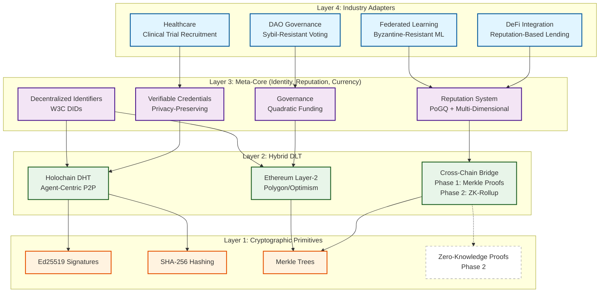

# Mycelix Protocol: System Architecture

This diagram shows the complete 4-layer architecture of the Mycelix Protocol, from industry-specific adapters down to the hybrid DLT foundation.



## Architecture Principles

### 1. Sovereignty First
Users maintain ultimate control over their identity and data through Holochain's agent-centric model.

### 2. Defense in Depth
Multiple security layers:
- **Economic**: Staking and slashing
- **Cryptographic**: Signatures, hashes, proofs
- **Algorithmic**: PoGQ validation, Byzantine resistance

### 3. Pragmatic Decentralization
- **Holochain**: Scalability and sovereignty (P2P networking, DHT storage)
- **Ethereum L2**: Finality and settlement (global state, DeFi integration)

### 4. Evolvability
Clear upgrade path from Phase 1 (Merkle Proofs) to Phase 2 (Zero-Knowledge Proofs).

## Data Flow Example: Federated Learning Contribution

```
User (Training Node)
    ↓
    └─► 1. Train model on local data
    └─► 2. Compute gradient update
    └─► 3. Submit to Holochain agent
         ↓
Holochain DHT
    ↓
    └─► 4. Create source chain entry
    └─► 5. Publish gradient hash to DHT
    └─► 6. Trigger VRF validator selection
         ↓
Validator Nodes
    ↓
    └─► 7. Download gradient from DHT
    └─► 8. Validate using private test dataset
    └─► 9. Compute PoGQ quality score
    └─► 10. Submit validation to DHT
          ↓
Reputation System
    ↓
    └─► 11. Aggregate validation scores
    └─► 12. Update contributor reputation
    └─► 13. Filter low-quality gradients
          ↓
Ethereum Layer-2 (Optional)
    ↓
    └─► 14. Commit reputation anchors on-chain
    └─► 15. Enable cross-platform portability
```

## Technology Stack

| Layer | Component | Technology | Purpose |
|-------|-----------|------------|---------|
| **Industry Adapters** | Federated Learning | PyTorch | Byzantine-resistant ML training |
| | Healthcare | FHIR/ICD-10 | Clinical data standards |
| | DAO Governance | Snapshot/Aragon | Voting mechanisms |
| **Meta-Core** | Identity | W3C DIDs | Self-sovereign identity |
| | Credentials | W3C VCs | Privacy-preserving claims |
| | Reputation | PoGQ | Quality validation |
| **Hybrid DLT** | P2P Network | Holochain | Agent-centric storage |
| | Settlement | Polygon/Optimism | L2 scalability |
| | Bridge | Validators + Merkle | Phase 1 security |
| **Primitives** | Signatures | Ed25519 | Fast, secure signing |
| | Hashing | SHA-256 | Content addressing |
| | Proofs | Merkle Trees | Efficient verification |

## Scalability Analysis

### Phase 1 (Current: Merkle Proofs)
- **Throughput**: ~1,000 transactions/day
- **Latency**: ~10 seconds for bridge finalization
- **Cost**: ~50,000 gas per bridge operation (~$2-5 at 100 gwei)

### Phase 2 (Future: ZK-Rollup)
- **Throughput**: ~100,000 transactions/day (100x improvement)
- **Latency**: ~1 second for proof generation + verification
- **Cost**: ~300,000 gas per batch of 1,000 transactions (~$0.01 per transaction)

## Key Innovation: Proof of Gradient Quality (PoGQ)

The PoGQ mechanism enables trust-minimized federated learning:

1. **Private Validation**: Validators test gradients on their own private datasets
2. **Quality Scoring**: Loss improvement → quality score ∈ [0, 1]
3. **Byzantine Detection**: Low scores indicate poisoning attempts
4. **Reputation-Weighted Aggregation**: Honest contributors gain influence over time

**Experimental Results**: +37.9 percentage points improvement over Multi-Krum baseline under extreme non-IID conditions (Dirichlet α=0.1, 30% Byzantine adaptive attack). 93.9% accuracy achieved vs. 56.0% for classical defenses.

---

**Export Instructions**:
1. View on GitHub (renders automatically)
2. Export to PNG: Use [Mermaid Live Editor](https://mermaid.live/)
3. Export to SVG: Use `mmdc` CLI tool
4. Include in grant application documents
