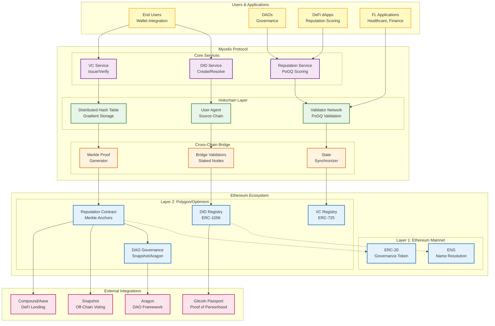
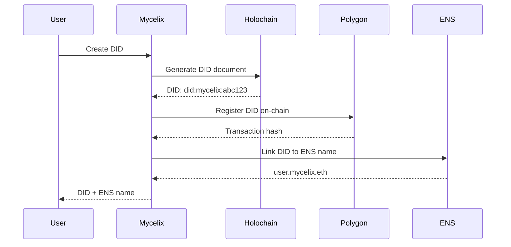
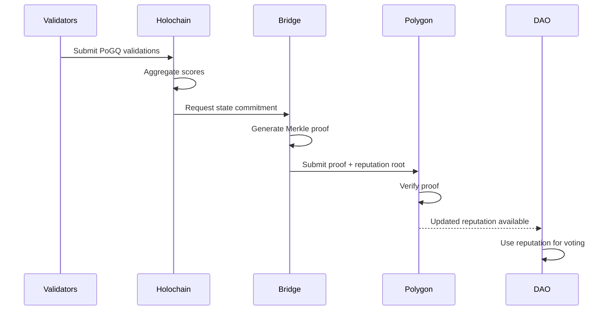
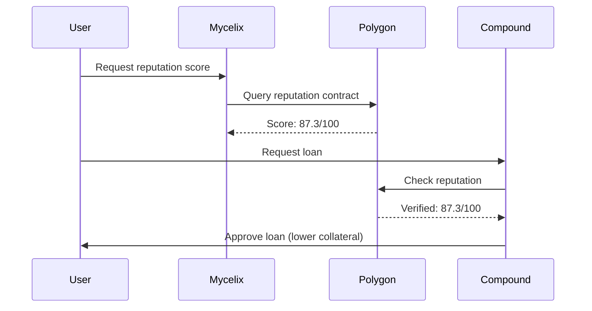

# Mycelix Protocol: Ethereum Ecosystem Integration

This diagram shows how the Mycelix Protocol integrates with the Ethereum ecosystem to provide decentralized identity, reputation, and governance infrastructure.



## Integration Points

### 1. Identity Layer (W3C DIDs + Ethereum)



### 2. Reputation Bridging (Holochain → Ethereum L2)



### 3. DeFi Integration (Reputation-Based Lending)



## Smart Contract Architecture

### Reputation Contract (Polygon)

```solidity
// Simplified example
contract MycelixReputation {
    struct ReputationAnchor {
        bytes32 merkleRoot;      // Root of reputation Merkle tree
        uint256 timestamp;        // Block timestamp
        address[] validators;     // Bridge validators who signed
        bytes[] signatures;       // Validator signatures
    }

    mapping(address => uint256) public reputationScores;
    ReputationAnchor[] public anchors;

    function submitAnchor(
        bytes32 _merkleRoot,
        bytes[] memory _signatures
    ) external onlyBridge {
        // Verify validator signatures
        // Store anchor
        // Emit event for indexing
    }

    function verifyReputation(
        address _user,
        uint256 _score,
        bytes32[] memory _proof
    ) public view returns (bool) {
        // Verify Merkle proof against latest anchor
    }
}
```

## Gas Cost Analysis

### Phase 1 (Merkle Proofs)

| Operation | Gas Cost | USD Cost (100 gwei) |
|-----------|----------|-------------------|
| Submit reputation anchor | ~80,000 | ~$3-6 |
| Verify reputation (read) | ~30,000 | ~$1-2 |
| Register DID | ~50,000 | ~$2-4 |
| Bridge 1,000 users | ~150,000 | ~$6-12 |

**Optimization**: Batch multiple operations into single transaction

### Phase 2 (ZK-Rollup - Estimated)

| Operation | Gas Cost | USD Cost (100 gwei) |
|-----------|----------|-------------------|
| Submit ZK proof (1,000 tx) | ~300,000 | ~$12-24 |
| Verify single reputation | ~5,000 | ~$0.20-0.40 |
| **Cost per user** | ~300 | **~$0.01-0.02** |

**Improvement**: 100x reduction in cost per user

## Ecosystem Integration Roadmap

### Phase 1 (Current)
- ✅ ERC-1056 DID registry
- ✅ Merkle proof bridge
- ✅ Basic reputation anchoring

### Phase 2 (Q1-Q2 2026)
- Snapshot strategy for reputation-weighted voting
- Gitcoin Passport integration for Sybil resistance
- ENS resolution for DIDs
- Compound/Aave integration for reputation-based lending

### Phase 3 (Q3-Q4 2026)
- ZK-Rollup upgrade for scalability
- Cross-chain bridge (Ethereum ↔ Polygon ↔ Optimism)
- DAO treasury management
- Aragon plugin for reputation governance

## Ethereum Ecosystem Benefits

### For DAOs
- **Sybil Resistance**: Reputation makes fake identities costly
- **Merit-Based Governance**: Weight votes by contribution quality
- **Progressive Decentralization**: Gradually transfer control to contributors

### For DeFi
- **Under-Collateralized Lending**: Use reputation as collateral
- **Risk Assessment**: Better credit scoring for lending protocols
- **Fraud Prevention**: Detect and penalize malicious actors

### For dApps
- **Portable Reputation**: Users carry reputation across applications
- **Reduced Onboarding Friction**: Leverage existing reputation
- **Interoperability**: W3C standards + Ethereum standards

## Security Considerations

### Bridge Security Layers

1. **Economic Security**: Validators stake 100K USDC, slashed for misbehavior
2. **Cryptographic Security**: Merkle proofs verified on-chain
3. **Operational Security**: 7/10 multi-sig for emergency pause
4. **Fraud Proofs**: Anyone can challenge invalid state transitions (7-day window)

### Attack Vectors & Mitigations

| Attack | Mitigation |
|--------|-----------|
| Validator collusion | Slashing + reputation penalties |
| Merkle proof forgery | On-chain verification + fraud proofs |
| Front-running | Commit-reveal scheme for sensitive operations |
| MEV extraction | Flashbots integration + transaction ordering rules |
| Bridge manipulation | Multi-sig control + time locks |

---

**Export Instructions**:
1. View on GitHub (renders automatically)
2. Export to PNG: Use [Mermaid Live Editor](https://mermaid.live/)
3. Export to SVG: Use `mmdc` CLI tool
4. Include in grant application to show Ethereum alignment
