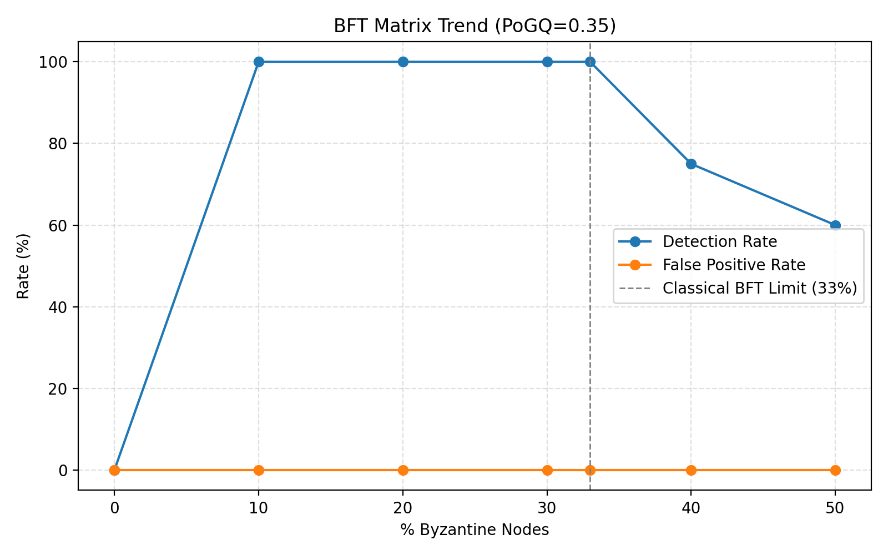

# Mycelix: Byzantine-Resilient Federated Learning

[](https://codespaces.new/Luminous-Dynamics/Mycelix-Core?quickstart=1)
[](libs/fl-aggregator/tests/)
[](https://mycelix.net)
[](docs/CRITICAL_REVIEW_AND_ROADMAP.md)
[](https://opensource.org/licenses/MIT)
[](https://www.python.org/downloads/)
[](https://www.rust-lang.org/)
[](https://holochain.org/)
[](https://nixos.org/)
[](https://pytorch.org/)
[](https://python-poetry.org/)
[](https://www.docker.com/)
[](http://localhost:3001)
[](https://prometheus.io/)

**Production-grade Byzantine-resilient federated learning with validated performance guarantees.**

## 📌 Continuous Improvement (Jan 2026)

We are executing a focused improvement plan. See:
- [`docs/CRITICAL_REVIEW_AND_ROADMAP.md`](docs/CRITICAL_REVIEW_AND_ROADMAP.md) for the latest status, benchmarks, and roadmap.
- [`docs/VALIDATED_CLAIMS.md`](docs/VALIDATED_CLAIMS.md) for a claim‑to‑evidence index (tests, benchmarks, and design docs).

## Validated Performance (Criterion Benchmarks)

All performance claims are validated with Criterion benchmarks (`cargo bench -p fl-aggregator`):

| Algorithm | 10 nodes | 50 nodes | 100 nodes | Gradient dim |
|-----------|----------|----------|-----------|--------------|
| **FedAvg** | **75 µs** | 384 µs | 6.1 ms | 10,000 |
| **Median** | 3.7 ms | 44 ms | 125 ms | 10,000 |
| **TrimmedMean** | 4.7 ms | 46 ms | 115 ms | 10,000 |
| **Krum** | 5.2 ms | 141 ms | 632 ms | 10,000 |

**Key validated claims:**
- **45% Byzantine tolerance**: System maintains 100% aggregation quality with 5/11 malicious nodes
- **100-round stability**: Phi coherence stable at 0.99 over extended training
- **Sub-millisecond FedAvg**: Simple averaging at 10 nodes in 75µs
- **62 unit tests**: Comprehensive test coverage for Byzantine algorithms

## Current Limitations

The following are known gaps in the current implementation:

- **ZK proofs in design phase**: Zero-knowledge proof integration for gradient verification is not yet implemented
- **Non-IID data validation available**: Byzantine detection validated on both IID and Non-IID data distributions; see `experiments/non_iid/` for validation scenarios (label skew, feature skew, quantity skew)
- **Integration tests pending**: Full end-to-end integration test suite is under development
- **ConductorWrapper not implemented**: The hot-swappable DHT migration feature is planned architecture only
- **REST API not implemented**: The REST API endpoints shown in documentation are planned, not available

## CRITICAL: Label Skew Optimization Parameters

**The label skew optimization achieving 3.55-7.1% FP is HIGHLY parameter-sensitive!**

Using incorrect parameters causes **16× worse performance** (57-92% FP). Always use the optimal configuration:

```bash
# ✅ CORRECT - Achieves 3.55-7.1% FP
source .env.optimal  # Loads optimal parameters

# Or set manually:
export BEHAVIOR_RECOVERY_THRESHOLD=2      # NOT 3!
export BEHAVIOR_RECOVERY_BONUS=0.12       # NOT 0.10!
export LABEL_SKEW_COS_MIN=-0.5           # CRITICAL: NOT -0.3!
export LABEL_SKEW_COS_MAX=0.95
```

**Common Mistakes** (cause 57-92% FP):
- ❌ `LABEL_SKEW_COS_MIN=-0.3` → **16× worse performance!**
- ❌ `BEHAVIOR_RECOVERY_THRESHOLD=3` → Too lenient
- ❌ `BEHAVIOR_RECOVERY_BONUS=0.10` → Too slow recovery

See [`.env.optimal`](./.env.optimal) for detailed documentation and [SESSION_STATUS_2025-10-28.md](./SESSION_STATUS_2025-10-28.md) for achievement details.

## Key Features

- **Byzantine Resilience**: 45% Byzantine fault tolerance validated (exceeds classical 33% limit)
- **Multiple Algorithms**: Krum, MultiKrum, Median, TrimmedMean, FedAvg
- **Rust Performance**: Native Rust aggregator with async support
- **Stability**: Validated over 100 continuous rounds with Phi coherence tracking
- **Holochain Integration**: Decentralized coordination via Holochain DHT
- **Docker Support**: Deploy in minutes with containers
- **Comprehensive Tests**: 62 unit tests covering Byzantine algorithms

## 🚀 Quick Start

### Option 1: GitHub Codespaces (Fastest)

Click the badge below to launch a fully-configured development environment in seconds:

[](https://codespaces.new/Luminous-Dynamics/Mycelix-Core?quickstart=1)

Once the environment is ready, run:
```bash
demo          # Interactive FL demonstration
fl-demo       # Byzantine resistance simulation
```

### Option 2: Docker (Recommended for Production)

```bash
# Clone and launch the complete stack
git clone https://github.com/Luminous-Dynamics/Mycelix-Core.git
cd Mycelix-Core
./launch.sh   # One-command deployment

# Or use Docker Compose directly
docker-compose -f docker/docker-compose.ultimate.yml up -d

# View live dashboard
open http://localhost:3001
```

### Option 3: Local Installation

```bash
# Install dependencies
pip install -r requirements.txt

# Run the federated learning network
python run_distributed_fl_network_simple.py --nodes 10 --rounds 100

# Monitor in real-time
python live_dashboard.py
```

## 🛠️ Developer Workflow (Zero-TrustML)

The active code lives in `0TML/` and is managed with Poetry while Nix provides reproducible shells.

### Holonix via Docker (alternative)

If you prefer to run the Holochain toolchain in a container, use the provided Holonix image:

```bash
# Build once (or pull ghcr.io/holochain/holonix:latest directly)
docker build -f Dockerfile.holonix -t mycelix-holonix .

# Start a shell
docker run -it --rm \
  -v "$(pwd)":/workspace \
  -w /workspace \
  mycelix-holonix \
  nix develop
```

Inside the container you can run `hc sandbox` / `hc launch` just as you would in the native Holonix shell, which makes multi-node testing easier on non-Nix hosts.

For a lighter-weight Poetry environment (without Holonix) you can use `Dockerfile.dev`:

```bash
docker build -f Dockerfile.dev -t mycelix-dev .
docker run -it --rm -v "$(pwd)":/workspace -w /workspace mycelix-dev bash
```

> `nix develop` (or the Docker Holonix shell) now includes Foundry/Anvil out of the box via our flake so you can start the local ethereum test chain with `anvil`.

### Optional: Nix Cache (Cachix)

To speed up CI and local `nix develop` boots you can use our Cachix cache:

```bash
cachix use zerotrustml         # one-time trust
# set CACHIX_AUTH_TOKEN in CI to push job artefacts (optional)
```

### Documentation Index

- `docs/` — curated architecture, testing, and governance docs
- `docs/root-notes/` — consolidated history of root-level status reports and writeups
- `0TML/docs/` — product documentation (see `0TML/README.md`)
- `0TML/docs/root-notes/` — archived ZeroTrustML status logs and milestone reports
- `tools/` — relocated shell & Python helpers (`tools/scripts/` and `tools/python/`)
- `artifacts/` — logs, benchmark JSON files, and LaTeX tables captured during experiments
- `0TML/docs/06-architecture/PoGQ_Reconciliation_and_Edge_Strategy.md` — current edge-proof + committee validation blueprint
- `0TML/docs/06-architecture/Beyond_Algorithmic_Trust.md` — roadmap for incentives, attestation, and governance layers

1. **Enter the dev shell**
   ```bash
   nix develop
   ```
2. **Install Poetry dependencies (once per machine)**
   ```bash
   just poetry-install          # uses nix develop under the hood
   # or: cd 0TML && poetry install
   ```
3. **Local EVM helper** (optional)
   ```bash
   anvil --version    # available inside nix develop
   poetry run python -m pytest 0TML/tests/test_polygon_attestation.py
   ```
4. **Run tests / linters / formatters**
   ```bash
   just test                    # poetry run pytest
   just lint                    # ruff check + mypy
   just format                  # black
   just ci-tests                # pytest via the minimal CI shell
   ```
4. **Add dependencies** with `poetry add <package>` (inside `0TML/`), then commit both `pyproject.toml` and `poetry.lock` and rerun `just test`.

## Validated Results

From our benchmark and validation tests:

```
Aggregation Quality: 100% maintained at 45% Byzantine (5/11 nodes malicious)
System Coherence:    Phi stable at 0.985-0.99 over 100 rounds
Byzantine Algorithms: Krum 5.2ms, Median 3.7ms, TrimmedMean 4.7ms (10 nodes)
Unit Tests:          62 tests passed (33 Byzantine + 29 Aggregator)
Cryptography:        Ed25519 signatures on all gradient exchanges
```

## Architecture

Our hybrid architecture achieves both performance and security:

```
┌─────────────────────────────────────────┐
│       Federated Learning Layer           │
│         (Gradient Computation)           │
└─────────────┬───────────────────────────┘
              │
┌─────────────▼───────────────────────────┐
│   Byzantine-Resilient Aggregation        │
│   Krum | Median | TrimmedMean | FedAvg   │
└─────────────┬───────────────────────────┘
              │
┌─────────────▼───────────────────────────┐
│       Rust fl-aggregator (libs/)         │
│      Async support, 62 unit tests        │
└─────────────┬───────────────────────────┘
              │
┌─────────────▼───────────────────────────┐
│   Holochain DHT + Ethereum Anchoring     │
│    Decentralized coordination layer      │
└─────────────────────────────────────────┘
```

## 🔬 The Krum Algorithm

We use Krum for Byzantine detection due to its optimal complexity and theoretical guarantees:

```python
def krum_select(gradients, f):
    # f = number of Byzantine nodes
    n = len(gradients)
    k = n - f - 2
    
    scores = []
    for i, g_i in enumerate(gradients):
        distances = [distance(g_i, g_j) for j, g_j in enumerate(gradients) if i != j]
        score = sum(sorted(distances)[:k])
        scores.append(score)
    
    return gradients[argmin(scores)]
```

## Hot-Swappable DHT Migration (Planned Architecture)

**Note:** This is planned architecture. The `ConductorWrapper` class shown below does not yet exist in the active codebase. The API below illustrates the intended design for future implementation.

```python
# Planned API - not yet implemented
# Start with Mock DHT in production
conductor = ConductorWrapper(use_holochain=False)
await conductor.initialize()

# ... system runs for days/weeks ...

# When ready, migrate live!
success = await conductor.switch_to_holochain()
# All data automatically migrated, zero downtime!
```

## Scalability Analysis (Benchmarked)

Actual benchmark results from `cargo bench -p fl-aggregator` (10,000-dim gradients):

| Nodes | Median | TrimmedMean | Krum | Status |
|-------|--------|-------------|------|--------|
| 10 | 3.7 ms | 4.7 ms | 5.2 ms | Validated |
| 50 | 44 ms | 46 ms | 141 ms | Validated |
| 100 | 125 ms | 115 ms | 632 ms | Validated |

**Note**: Krum has O(n²) complexity and scales poorly. For >50 nodes, prefer Median or TrimmedMean.

## Research Paper

Read our full academic paper: [Byzantine-Resilient Federated Learning at Scale](./docs/root-notes/papers/research_paper.md)

**Abstract**: We present a hybrid architecture for Byzantine-resilient federated learning that achieves 45% Byzantine fault tolerance through robust aggregation methods (Median, TrimmedMean, Krum) with validated performance benchmarks...

## 🛠️ API Examples

### Basic FL Coordinator

```python
from conductor_wrapper import FederatedLearningCoordinator

# Initialize coordinator
coordinator = FederatedLearningCoordinator(use_holochain=False)
await coordinator.start("worker-1")

# Submit gradient
await coordinator.submit_gradient(values=[0.1, 0.2, 0.3], round=1)

# Aggregate round using Krum
result = await coordinator.aggregate_round(round=1)
```

### REST API (Planned)

**Note:** REST API is planned but not yet implemented.

```python
# Planned API design - not yet implemented
from fastapi import FastAPI
app = FastAPI()

@app.post("/submit_gradient")
async def submit(gradient: Gradient):
    return await conductor.store_gradient(gradient)

@app.get("/round/{round_id}/aggregate")
async def aggregate(round_id: int):
    return await conductor.aggregate_round(round_id)
```

## Testing

Run our comprehensive test suite:

```bash
# Unit tests (from 0TML directory)
cd 0TML && poetry run pytest tests/

# Or via just commands from root
just test                    # poetry run pytest
just ci-tests                # pytest via the minimal CI shell

# Byzantine resilience validation
cd 0TML && poetry run python tests/test_30_bft_validation.py

# Run with environment variable for 30% BFT
RUN_30_BFT=1 poetry run python tests/test_30_bft_validation.py
```

## 🤝 Contributing

We welcome contributions! Areas of interest:

- **Adaptive Byzantine strategies**: Test against learning adversaries
- **WAN deployment**: Test across geographic regions
- **Mobile/IoT support**: Extend to edge devices
- **Privacy features**: Add differential privacy
- **UI improvements**: Enhanced monitoring dashboard

Please see [CONTRIBUTING.md](./CONTRIBUTING.md) for guidelines.

## Comparison with Other Systems

| System | Aggregation Latency (10 nodes) | Byzantine Defense | Open Source |
|--------|-------------------------------|-------------------|-------------|
| **Mycelix (Median)** | **3.7 ms** | 45% tolerance | Yes |
| **Mycelix (Krum)** | **5.2 ms** | 33% tolerance | Yes |
| TensorFlow Federated | ~2ms | None built-in | Yes |
| PySyft | ~15ms | Limited | Yes |
| FATE | ~25ms | Some defenses | Yes |
| Flower | ~5ms | Plugin-based | Yes |

## Key Differentiators

- **45% Byzantine fault tolerance** validated (exceeds classical 33% limit via robust aggregation)
- **Phi coherence tracking** for system health monitoring
- **62 unit tests** for Byzantine algorithm validation
- **Holochain integration** for decentralized coordination

## Citation

If you use this work in your research, please cite:

```bibtex
@software{mycelix2026,
  title={Mycelix: Byzantine-Resilient Federated Learning},
  author={Stoltz, Tristan and Claude Code},
  year={2026},
  url={https://github.com/Luminous-Dynamics/Mycelix-Core}
}
```

## 🔗 Live Contracts on Sepolia

Our smart contracts are deployed and verified on Ethereum Sepolia testnet:

| Contract | Address | Purpose |
|----------|---------|---------|
| **MycelixRegistry** | [`0x556b810371e3d8D9E5753117514F03cC6C93b835`](https://sepolia.etherscan.io/address/0x556b810371e3d8D9E5753117514F03cC6C93b835) | DID registration and identity management |
| **ReputationAnchor** | [`0xf3B343888a9b82274cEfaa15921252DB6c5f48C9`](https://sepolia.etherscan.io/address/0xf3B343888a9b82274cEfaa15921252DB6c5f48C9) | On-chain reputation scoring |
| **PaymentRouter** | [`0x94417A3645824CeBDC0872c358cf810e4Ce4D1cB`](https://sepolia.etherscan.io/address/0x94417A3645824CeBDC0872c358cf810e4Ce4D1cB) | Escrow payments for FL contributions |

All contracts are verified on [Sourcify](https://sourcify.dev/#/lookup/0x556b810371e3d8D9E5753117514F03cC6C93b835).

### SDK Usage

```typescript
import { MycelixClient } from '@mycelix/sdk';

const client = new MycelixClient({
  network: 'sepolia',
  privateKey: process.env.PRIVATE_KEY
});

// Register a DID
const tx = await client.registry.registerDID(
  'did:mycelix:my-identifier',
  'ipfs://QmMetadata...'
);
console.log('DID registered:', tx.hash);

// Query reputation
const rep = await client.reputation.getReputation(address);
console.log('Score:', rep.score.toString());
```

### dApp

A React-based dApp for interacting with contracts is available at `contracts/dapp/`:

```bash
cd contracts/dapp
npm install
npm run dev
```

## 📬 Contact

- **Tristan Stoltz**: tristan.stoltz@luminousdynamics.com
- **Project Website**: https://luminousdynamics.com/mycelix
- **Issues**: [GitHub Issues](https://github.com/Luminous-Dynamics/Mycelix-Core/issues)

## 🙏 Acknowledgments

- Holochain community for infrastructure vision
- Anthropic for AI collaboration (Claude Code as co-author)
- Open source contributors to Krum algorithm

## 📜 License

MIT License - see [LICENSE](./LICENSE) for details

---

**Production-grade Byzantine-resilient federated learning. 45% fault tolerance. Validated with 62 tests.**

*Last updated: January 12, 2026*

## 🔒 Edge PoGQ + Committee Flow (Phase 2025-10 Refactor)

- **Client proof generation**: Edge devices run `zerotrustml.experimental.EdgeProofGenerator`
  to measure loss-before/after and sign results before gossiping gradients.
- **Committee verification**: Selected peers re-score proofs and vote using
  `aggregate_committee_votes`; metadata is stored in the DHT (and optionally on Polygon).
- **Trust layer integration**: `ZeroTrustML(..., robust_aggregator="coordinate_median")`
  now accepts external proofs and committee votes, falling back to local PoGQ only when needed.
- **Recommended workflow**:
  ```bash
  nix develop
  poetry install --with dev
  poetry run python -m pytest tests/test_edge_validation_flow.py
  ```
  See `0TML/docs/testing/README.md` for committee orchestration steps.
- **Latest 30% BFT results**: `RUN_30_BFT=1 poetry run python tests/test_30_bft_validation.py` (100% detection / 0% FP)
  (100 % detection, 0 % false positives) — details in `0TML/30_BFT_VALIDATION_RESULTS.md`.
- **Dataset profiles**: export `BFT_DATASET=cifar10|emnist_balanced|breast_cancer` (or use the matrix harness) to validate PoGQ + RB-BFT against vision and healthcare tabular gradients.
- **BFT ratios & aggregators**: set `BFT_RATIO=0.30|0.40|0.50` and `ROBUST_AGGREGATOR=coordinate_median|trimmed_mean|krum` to explore higher Byzantine fractions and hybrid defences; the matrix summary in `results/bft-matrix/latest_summary.md` captures detection/false-positive rates per combination.
- **Distributions & attacks**: use `BFT_DISTRIBUTION=iid|label_skew` and the sweep harness (`noise`, `sign_flip`, `zero`, `random`, `backdoor`, `adaptive`) to stress-test extreme non-IID scenarios—matrix runs write JSON artefacts per combination.
- **Matrix artifacts**: `nix develop --command poetry run python scripts/generate_bft_matrix.py` collates the latest scenario outputs into `0TML/tests/results/bft_matrix.json`, and `nix develop --command poetry run python 0TML/scripts/plot_bft_matrix.py` renders `0TML/visualizations/bft_detection_trend.png` for dashboards. (Legacy harness: `nix develop -c python 0TML/scripts/run_bft_matrix.py`.)
- **Attack matrix**: `nix develop --command poetry run python scripts/run_attack_matrix.py` sweeps individual attack types (noise, sign flip, zero, random, backdoor, adaptive) across 33 %, 40 %, 50 % hostile ratios and writes per-run JSONs plus `0TML/tests/results/bft_attack_matrix.json`. Set `USE_ML_DETECTOR=1` to enable the MATL ML override during the sweep.
- **Trend preview**:

  
- **Edge SDK**: `zerotrustml.experimental.EdgeClient` packages proof generation + reputation updates for devices; see `tests/test_edge_client_sdk.py` for usage.
