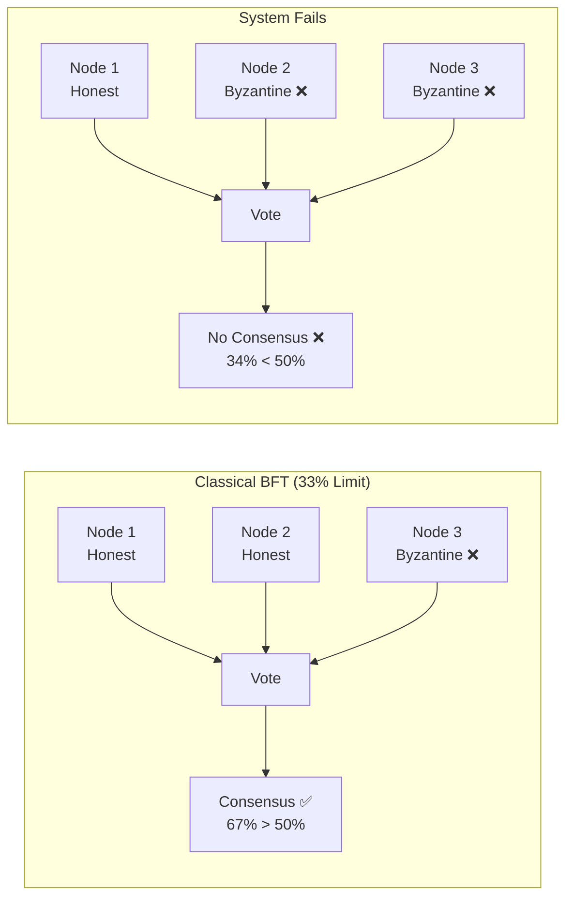
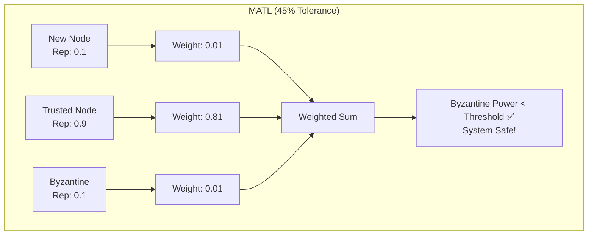
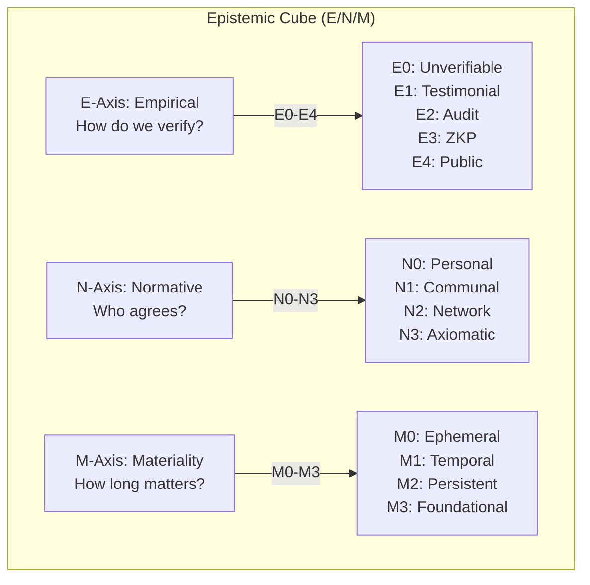
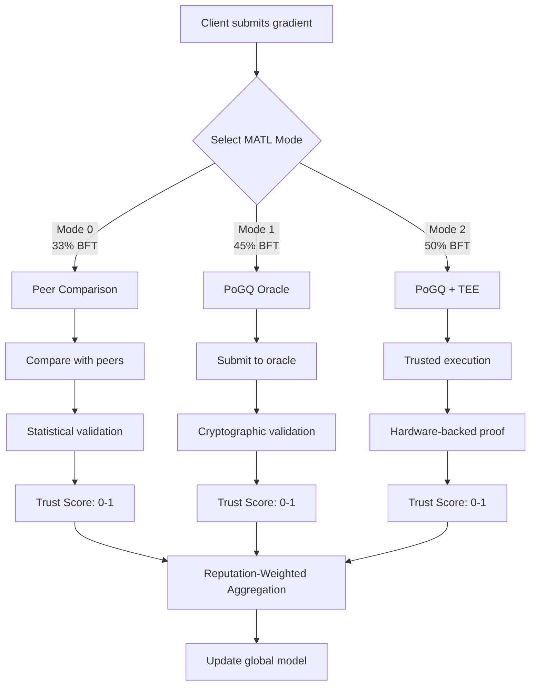
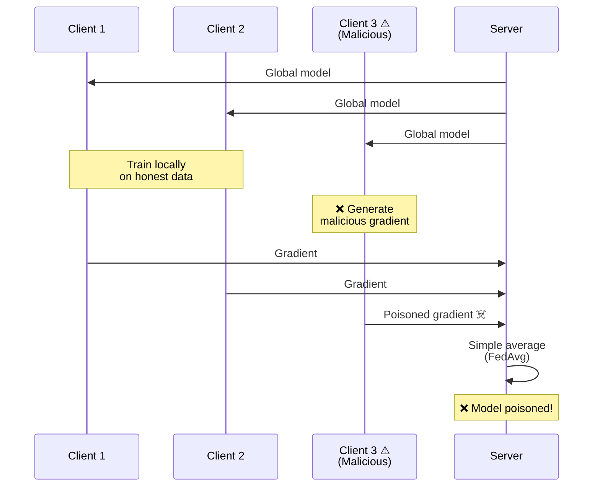
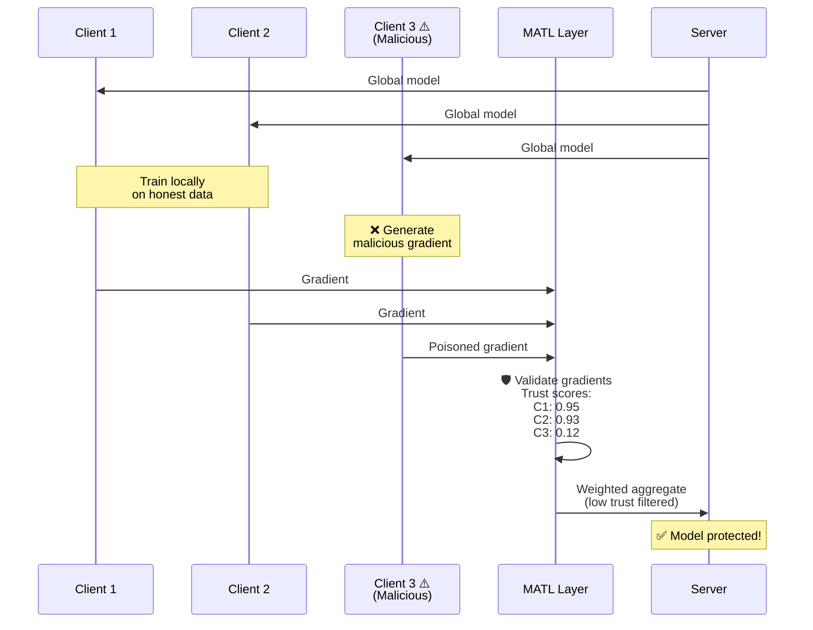
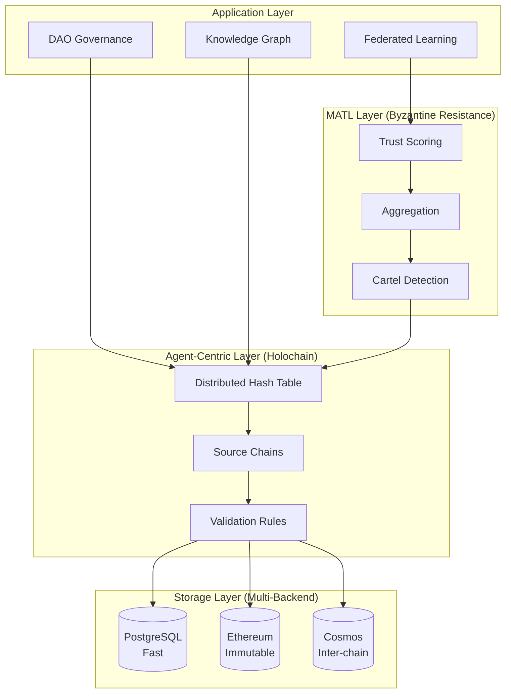
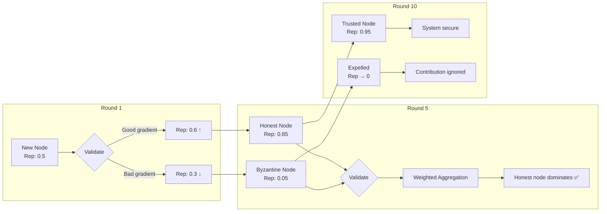
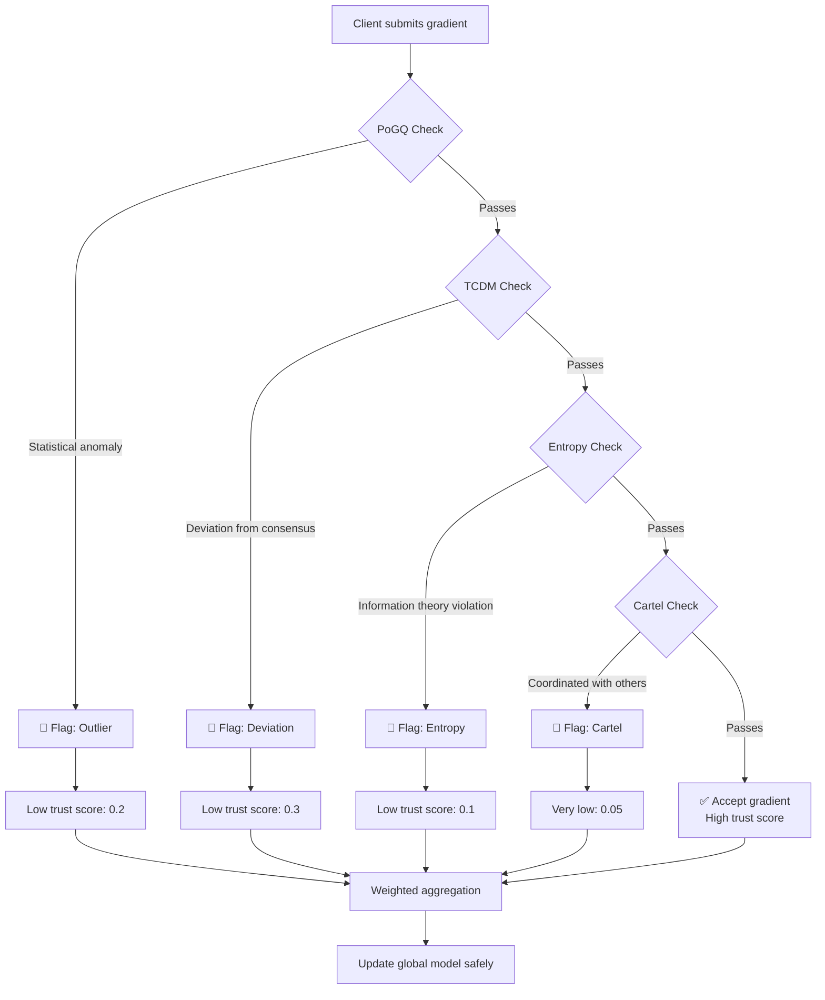
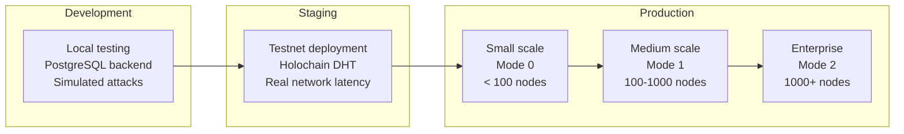

# 📊 Mycelix Protocol Visual Diagrams

**Interactive diagrams explaining key concepts and architecture**

---

## 1. Byzantine Fault Tolerance: Breaking the 33% Barrier

### Classical BFT Limitation

**Problem:** With >33% Byzantine nodes, honest nodes can't reach majority consensus.

### MATL Solution: Reputation-Weighted Validation

**Key Insight:** `Byzantine_Power = Σ(malicious_reputation²)`

Even with 45% malicious **nodes**, if they have low reputation, their Byzantine **power** stays below the safety threshold.

---

## 2. The Epistemic Cube: 3D Truth Framework

### Three Independent Axes

### Examples of Claims

| Claim | E-Axis | N-Axis | M-Axis | Classification |
|-------|--------|--------|--------|----------------|
| "I like pizza" | E0 | N0 | M0 | (0,0,0) - Personal preference |
| Community vote result | E0 | N2 | M3 | (0,2,3) - Governance record |
| Mathematical proof | E4 | N3 | M3 | (4,3,3) - Universal truth |
| Encrypted health record | E2 | N1 | M2 | (2,1,2) - Private persistent data |

---

## 3. MATL System Architecture

### Three-Mode Operation

**Mode Selection:**
- **Mode 0**: Fastest, peer-to-peer validation
- **Mode 1**: ⭐ Recommended for most use cases
- **Mode 2**: Maximum security for critical applications

---

## 4. Federated Learning Data Flow

### Without MATL (Vulnerable)

### With MATL (Protected)

---

## 5. System Component Interactions

### Complete Mycelix Stack

---

## 6. Trust Score Evolution Over Time

### Reputation Learning

**Key Properties:**
- ✅ Honest nodes gain reputation over time
- ❌ Byzantine nodes lose reputation quickly
- 🛡️ System becomes more secure with each round

---

## 7. Attack Detection Flow

### How MATL Detects Byzantine Behavior

**Defense Mechanisms:**
1. **PoGQ**: Proof of Gradient Quality (statistical validation)
2. **TCDM**: Trust-Corrected Debiased Mean
3. **Entropy**: Information-theoretic anomaly detection
4. **Cartel**: Graph-based clustering analysis

---

## 8. Deployment Options

### From Development to Production

**Scaling Path:**
- Start small with Mode 0 (faster, simpler)
- Scale to Mode 1 for higher BFT tolerance
- Add Mode 2 with TEE for mission-critical applications

---

## 📖 Related Documentation

- **[MATL Architecture](../0TML/docs/06-architecture/matl_architecture.md)** - Technical deep dive
- **[MATL Integration Tutorial](../tutorials/matl_integration.md)** - Hands-on guide
- **[System Architecture v5.2](../architecture/Mycelix Protocol_ Integrated System Architecture v5.2.md)** - Complete design
- **[Epistemic Charter v2.0](../architecture/THE EPISTEMIC CHARTER (v2.0).md)** - 3D truth framework details

---

**Diagrams created with [Mermaid.js](https://mermaid.js.org/)**
*Interactive and version-controlled documentation*
