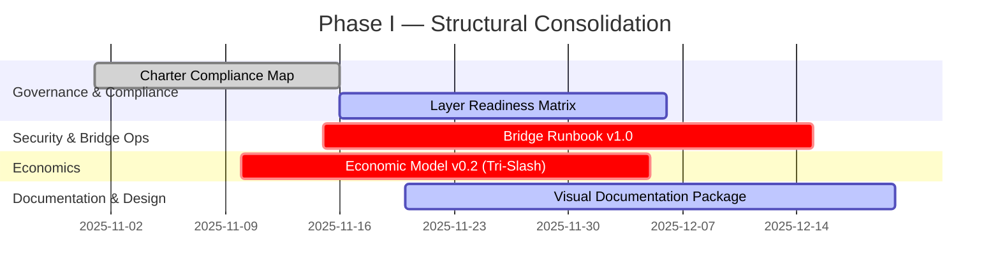
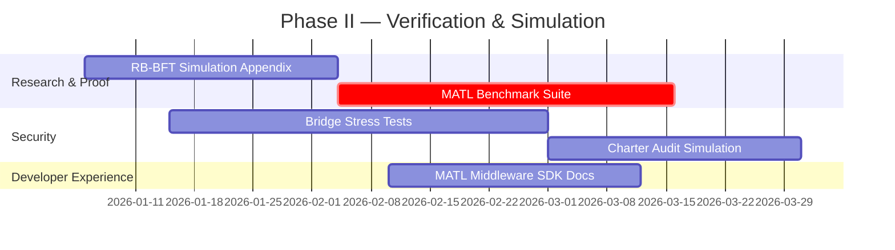
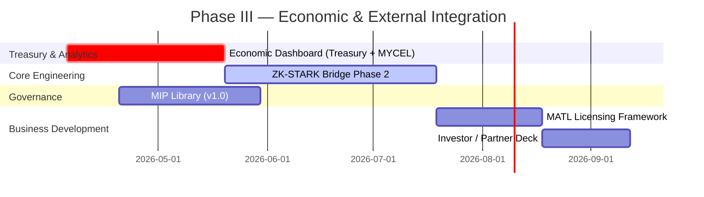
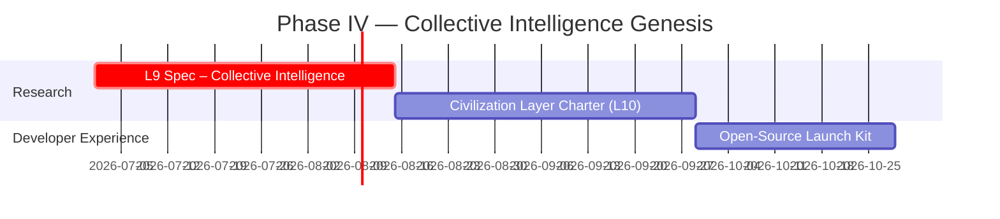
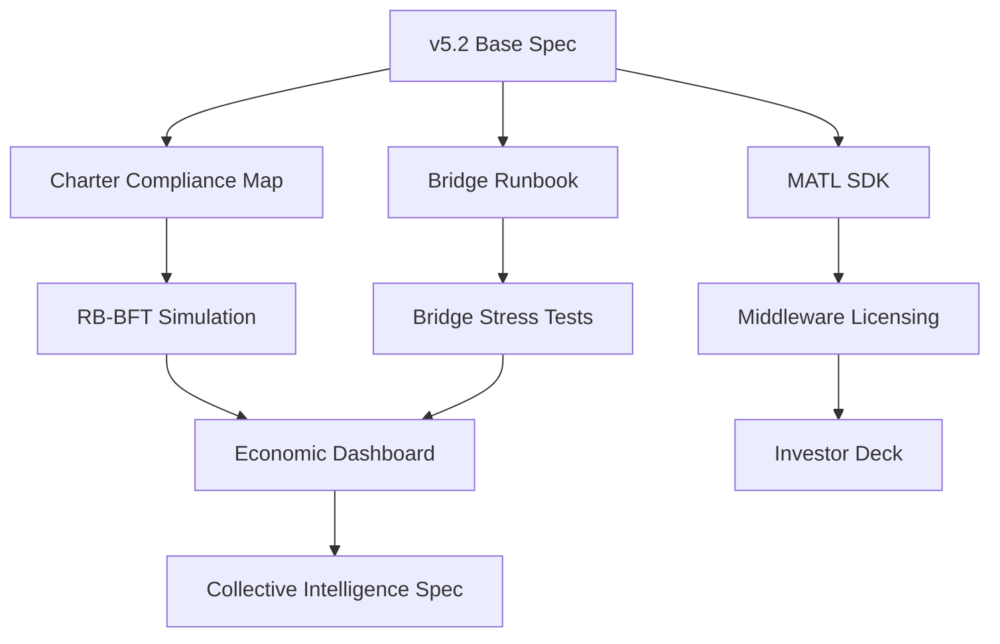

# 🧭 **Mycelix Protocol Improvement Roadmap (v5.3 → v6.0)**  
**Theme:** *From Verifiable Architecture → Verifiable Civilization*  
**Duration:** **Nov 2025 – Oct 2026**  
**Core Principle:** Ruthless scope discipline. Every layer verifiable before evolution.

---

## 📊 Gantt Chart Overview

| Phase | Focus | Duration | Primary Outputs |
|-------|--------|-----------|-----------------|
| **Phase I** | Structural Consolidation | Nov–Dec 2025 | Charter Map, Economic Model v0.2, Visual Docs |
| **Phase II** | Verification & Simulation | Jan–Mar 2026 | RB-BFT Simulations, MATL SDK, Bridge Tests |
| **Phase III** | Economic + External Integration | Apr–Jun 2026 | Treasury Dashboard, ZK Bridge, Licensing Framework |
| **Phase IV** | Collective Intelligence Genesis | Jul–Oct 2026 | L9–L10 Specs, Civilization Charter, Open Launch Kit |

---

<b>🏗️ PHASE I — Structural Consolidation (Nov–Dec 2025)</b>

**Goals:**
- Establish verifiable foundation for all constitutional and technical layers.  
- Introduce **economic model**, **readiness metrics**, and **visual system map**.  

**Deliverables:**
- ✅ Charter–Implementation Compliance Map  
- 📊 Layer Readiness Matrix  
- 🧱 Bridge Runbook (TVL caps, recovery flow)  
- 💰 Tri-Slash Economic Model v0.2  
- 🎨 Visual Architecture Package  

**Outcome:** *Publish Mycelix Integrated System Architecture v5.3.*

---

<b>🧬 PHASE II — Verification & Simulation (Jan–Mar 2026)</b>

**Goals:**
- Validate all verifiability claims under Byzantine conditions.  
- Finalize **zk-proof latency**, **differential privacy** thresholds, and **governance override flow**.  

**Deliverables:**
- 🧠 RB-BFT Simulation Appendix (Monte Carlo + 0TML)  
- 🔍 MATL zkML Benchmark Suite  
- 🧩 Bridge Stress Test Logs (1000+ TXs)  
- 📘 MATL SDK Developer Docs  
- 🧾 Charter Audit Simulation Reports  

**Outcome:** *Achieve “Constitutional Verification” milestone.*

---

<b>🌐 PHASE III — Economic & External Integration (Apr–Jun 2026)</b>

**Goals:**
- Integrate **economics**, **governance**, and **external adoption**.  
- Prepare Mycelix for institutional partnerships and middleware deployment.  

**Deliverables:**
- 💹 Economic Dashboard (Treasury, MYCEL, SAP analytics)  
- 🔒 ZK-STARK Bridge Phase 2 (Proof-based interoperability)  
- 🧾 Governance MIP Library (MIP-E/S/T standards)  
- 💼 MATL Licensing Framework (SDK revenue model)  
- 🎯 Investor & Partner Deck (market positioning)  

**Outcome:** *Phase 2 Testnet launch (DKG + ZK Bridge).*

---

<b>🪴 PHASE IV — Collective Intelligence Genesis (Jul–Oct 2026)</b>

**Goals:**
- Transition Mycelix from verifiable system → self-governing *civilizational protocol*.  
- Encode epistemic markets, cultural preservation, and open community launch.  

**Deliverables:**
- 🌐 L9 Spec: Collective Intelligence (zkML oracles, epistemic markets)  
- 🏛️ Civilization Charter (Cultural, ecological, memorial mandates)  
- 🔓 Open-Source Launch Kit (deploy + contribute)  

**Outcome:** *Mycelix Civilization OS (v6.0).*

---

## 🧩 **Dependency Graph**

---

## 🔑 **Top 5 Immediate Priorities (Next 45 Days)**

| # | Deliverable | Description | Owner | Priority |
|---|--------------|-------------|--------|-----------|
| 1 | **Charter Compliance Map** | Link each constitutional article to implemented modules | Governance | 🔥 |
| 2 | **Economic Model v0.2** | Model tokenomics, MYCEL weighting, and treasury flow | Treasury | 🔥 |
| 3 | **Bridge Runbook v1.0** | Post-exploit SOP and recovery playbook | Security Guild | 🔥 |
| 4 | **Visual Documentation Package** | Figma + SVG exports for Layer & Trust flow | Design | ⚡ |
| 5 | **MATL SDK Spec (Draft)** | Developer integration reference for licensing | DevRel | ⚡ |
