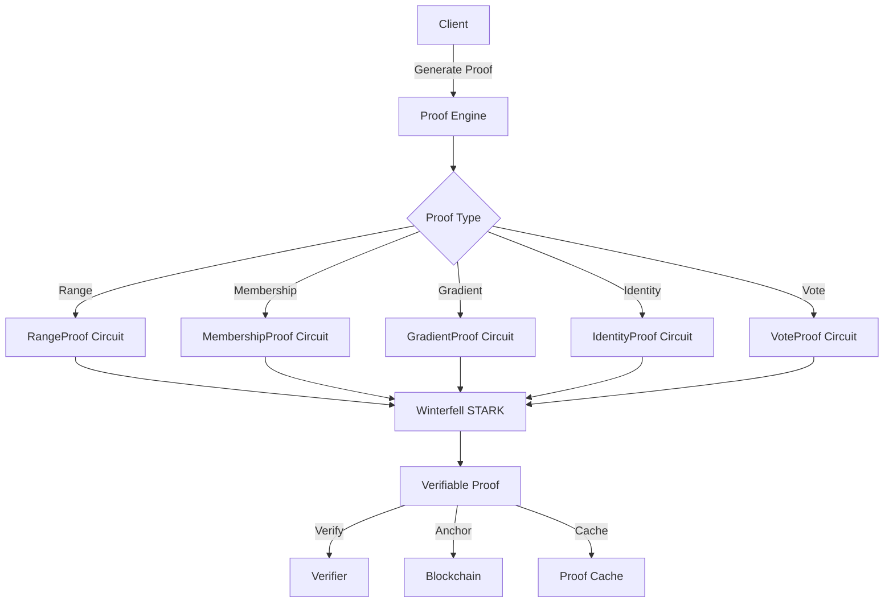

# fl-aggregator Proof System

Welcome to the documentation for the fl-aggregator zkSTARK proof system.

## What is this?

fl-aggregator provides **verifiable federated learning** through zero-knowledge proofs. It enables:

- **Proving gradient validity** without revealing the gradients
- **Verifying participant identity** while preserving privacy
- **Ensuring vote eligibility** for governance decisions
- **Anchoring proofs** to blockchains for immutability

## Key Features

### Five Proof Types

| Proof Type | Purpose | Use Case |
|------------|---------|----------|
| **RangeProof** | Prove value is within bounds | Gradient clipping, stake limits |
| **MembershipProof** | Prove set membership | Participant whitelist, merkle inclusion |
| **GradientIntegrityProof** | Prove gradient validity | FL contribution verification |
| **IdentityAssuranceProof** | Prove identity level | Access control, voting rights |
| **VoteEligibilityProof** | Prove voting eligibility | Governance participation |

### Performance

```
RangeProof:           25ms generation, 0.6ms verification
MembershipProof:       8ms generation, 0.15ms verification
GradientProof (1K):   17ms generation, 0.6ms verification
IdentityProof:        11ms generation, 0.03ms verification
VoteProof:             5ms generation, 0.17ms verification
```

### Security Levels

- **Standard96**: 96-bit security, fast proofs
- **Standard128**: 128-bit security, production default
- **High256**: 256-bit security, post-quantum resistant

## Quick Example

```rust
use fl_aggregator::proofs::{RangeProof, ProofConfig, SecurityLevel};

// Configure proof generation
let config = ProofConfig {
    security_level: SecurityLevel::Standard128,
    parallel: true,
    max_proof_size: 0,
};

// Generate a range proof
let proof = RangeProof::generate(50, 0, 100, config)?;

// Verify the proof
let result = proof.verify()?;
assert!(result.valid);
```

## Architecture



## Getting Started

1. **[Installation](./getting-started/installation.md)** - Add fl-aggregator to your project
2. **[Quick Start](./getting-started/quickstart.md)** - Generate your first proof
3. **[Configuration](./getting-started/configuration.md)** - Tune for your use case

## Documentation Sections

- **[Proof Types](./proofs/overview.md)** - Deep dive into each proof type
- **[Advanced Topics](./advanced/recursive.md)** - GPU, recursion, caching
- **[Integration](./integration/fl.md)** - Connect with FL, identity, governance
- **[Security](./security/model.md)** - Threat model and best practices
- **[Operations](./ops/deployment.md)** - Deploy and monitor in production
- **[API Reference](./api/core.md)** - Complete API documentation

## License

This project is licensed under the Apache 2.0 License.

## Support

- **GitHub Issues**: [Report bugs and request features](https://github.com/luminous-dynamics/mycelix-core/issues)
- **Discord**: Join our community for discussions
- **Email**: security@luminous-dynamics.com for security issues
