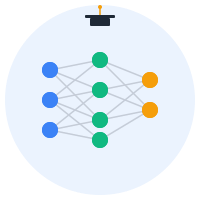

<div align="center">
  

  # Mycelix Praxis

  **Privacy-preserving decentralized education powered by Holochain and Federated Learning**

  [](https://github.com/Luminous-Dynamics/mycelix-praxis/actions/workflows/ci.yml)
  [](https://codecov.io/gh/Luminous-Dynamics/mycelix-praxis)
  [](LICENSE)
  [](https://www.rust-lang.org)
  [](https://holochain.org)
  [](CONTRIBUTING.md)

  > ⭐ **Star us on GitHub** — it helps the project grow!

  [Quick Start](#quick-start) · [Documentation](#documentation) · [Contributing](#contributing) · [Roadmap](ROADMAP.md)
</div>

---

## Vision

Praxis reimagines online learning by putting **learners in control** of their data while enabling **collaborative intelligence**. Using federated learning, models improve from collective experience without any single server seeing your private learning data.

## Features

- **Agent-Centric Learning**: Holochain hApp architecture, offline-friendly
- **Privacy-First FL**: Clipped gradient updates with optional differential privacy
- **Verifiable Credentials**: W3C VC standard tied to model provenance
- **Community Governance**: DAO for curricula, quality, and protocol evolution
- **Provenance Tracking**: Every model traceable to its training round and contributors

---

## Table of Contents

- [Quick Start](#quick-start)
- [Architecture](#architecture)
- [Documentation](#documentation)
- [Development](#development)
- [Contributing](#contributing)
- [Security](#security)
- [Governance](#governance)
- [License](#license)

---

## Quick Start

Get started in under 10 minutes! Follow our **[📖 Quick Start Tutorial](docs/tutorials/quick-start.md)** for a step-by-step guide.

### TL;DR

```bash
# Clone the repository
git clone https://github.com/Luminous-Dynamics/mycelix-praxis.git
cd mycelix-praxis

# Build all components
make build

# Run tests (49 tests should pass)
make test

# Start web app
cd apps/web && npm run dev
```

**Web app**: http://localhost:5173

### Docker

```bash
# Quick start with Docker
docker-compose up --build

# App at http://localhost:3000
```

**See also**: [Deployment Guide](docs/deployment.md) for production setups

---

## Architecture

Praxis is a **monorepo** combining Rust crates, Holochain zomes, and a React web client.

### Repository Structure

```
mycelix-praxis/
├── apps/web/              # React + TypeScript web client
├── crates/                # Rust libraries
│   ├── praxis-core/       # Core types, crypto, provenance
│   └── praxis-agg/        # Robust aggregation (trimmed mean, median)
├── zomes/                 # Holochain zomes (Rust → WASM)
│   ├── learning_zome/     # Courses, progress, activities
│   ├── fl_zome/           # Federated learning rounds & updates
│   ├── credential_zome/   # W3C Verifiable Credentials
│   └── dao_zome/          # Governance proposals & votes
├── schemas/               # W3C VC schemas + DHT entry definitions
├── docs/                  # Protocol, threat model, privacy, ADRs
├── scripts/               # Dev tooling (dev.sh, hc-reset.sh)
└── .github/               # CI workflows, issue templates
```

### Key Technologies

- **Holochain**: Agent-centric distributed computing
- **Rust**: Systems programming for zomes and crates
- **React + TypeScript**: Modern web UI
- **Federated Learning**: Privacy-preserving collaborative ML
- **W3C Verifiable Credentials**: Standards-based digital credentials

---

## Documentation

### Core Docs

- **[Protocol Specification](docs/protocol.md)**: FL lifecycle, message types, aggregation methods
- **[Threat Model](docs/threat-model.md)**: Security threats and mitigations
- **[Privacy Model](docs/privacy.md)**: Data handling, DP, selective disclosure
- **[Governance](GOVERNANCE.md)**: Decision-making processes, roles, DAO alignment

### Architecture Decision Records

- **[ADR-0001: FL Protocol v0](docs/adr/0001-protocol-v0.md)**: Message types and phases

See [`docs/adr/`](docs/adr/) for all ADRs.

### Schemas

- **[VC Schema: EduAchievementCredential](schemas/vc/EduAchievementCredential.schema.json)**
- **[DHT Entries](schemas/dht/entries.md)**: Holochain entry definitions

### Policies

- **[Code of Conduct](CODE_OF_CONDUCT.md)**
- **[Contributing Guide](CONTRIBUTING.md)**
- **[Security Policy](SECURITY.md)**

---

## Development

### Commands

```bash
# Development
make dev         # Build and start dev environment
make build       # Build Rust workspace + web app
make test        # Run all tests (Rust + web)
make check       # Quick sanity check (fmt + clippy + test)
make bench       # Run performance benchmarks
make fmt         # Format all code
make lint        # Run linters
make clean       # Clean build artifacts

# Holochain
make reset       # Reset local Holochain state (dev only)
```

### Project Structure

#### Rust Crates

**praxis-core** (`crates/praxis-core/`):
- Core types: `RoundId`, `ModelId`, `PrivacyParams`
- Cryptographic utilities (BLAKE3, commitments)
- Provenance tracking

**praxis-agg** (`crates/praxis-agg/`):
- Trimmed mean aggregation (default: 10% trim)
- Median aggregation (max robustness)
- Weighted mean
- L2 norm clipping

#### Holochain Zomes

**learning_zome** (`zomes/learning_zome/`):
- `Course`: Course metadata
- `LearnerProgress`: Progress tracking (private)
- `LearningActivity`: Activity logs (private)

**fl_zome** (`zomes/fl_zome/`):
- `FlRound`: FL round lifecycle
- `FlUpdate`: Gradient commitments + metadata

**credential_zome** (`zomes/credential_zome/`):
- `VerifiableCredential`: W3C VC issuance
- `CredentialStatus`: Revocation lists

**dao_zome** (`zomes/dao_zome/`):
- `Proposal`: Governance proposals (fast/normal/slow paths)
- `Vote`: Community voting

#### Web Client

**apps/web/**:
- React 18 + TypeScript
- Vite for fast builds
- Holochain client integration (planned)

---

## Federated Learning Protocol

### Overview

1. **DISCOVER**: Coordinator announces FL round
2. **JOIN**: Participants signal intent
3. **ASSIGN**: Coordinator selects participants
4. **UPDATE**: Participants train locally, submit clipped gradient commitments
5. **AGGREGATE**: Coordinator applies robust aggregation (trimmed mean/median)
6. **RELEASE**: New model published with provenance

See **[Protocol Docs](docs/protocol.md)** for details.

### Privacy Protections

- **Local training**: Raw data never leaves device
- **Gradient clipping**: Bounds individual contribution (default L2 norm ≤ 1.0)
- **Commitment scheme**: Only hash published to DHT initially
- **Robust aggregation**: Trimmed mean removes outliers
- **Differential privacy** (optional): Add calibrated noise

See **[Privacy Docs](docs/privacy.md)** for details.

---

## Contributing

We welcome contributions! Please read our **[Contributing Guide](CONTRIBUTING.md)** for:

- Development workflow
- Branch strategy (feature/fix/docs branches from `dev`)
- Commit conventions (Conventional Commits)
- Pull request process
- Code style (Rust: `rustfmt` + `clippy`, Web: `eslint` + `prettier`)

### Getting Help

- **Questions**: Open a [Discussion](https://github.com/Luminous-Dynamics/mycelix-praxis/discussions)
- **Bug reports**: [Open an issue](https://github.com/Luminous-Dynamics/mycelix-praxis/issues/new?template=bug_report.md)
- **Feature requests**: [Open an issue](https://github.com/Luminous-Dynamics/mycelix-praxis/issues/new?template=feature_request.md)

---

## Security

We take security seriously. See **[SECURITY.md](SECURITY.md)** for:

- Reporting vulnerabilities (security@mycelix.org or GitHub Security Advisories)
- Embargo policy (90 days)
- Threat model summary

**Do NOT** report security vulnerabilities via public issues.

---

## Governance

Praxis uses a **tiered decision framework**:

- **Fast path** (0-48h): Security fixes, critical bugs
- **Normal path** (3-14 days): Features, non-critical bugs
- **Slow path** (14+ days): Protocol changes, breaking changes

See **[GOVERNANCE.md](GOVERNANCE.md)** for roles, responsibilities, and DAO alignment roadmap.

---

## Roadmap

### v0.1.0-alpha (Current)

- [x] Monorepo scaffolding
- [x] Core types and aggregation crates
- [x] Zome entry definitions
- [x] Protocol, threat model, privacy docs
- [ ] FL zome implementation
- [ ] Web client Holochain integration
- [ ] End-to-end FL round (local testing)

### v0.2.0-beta

- [ ] DAO governance zome
- [ ] Credential issuance flow
- [ ] Differential privacy support
- [ ] Multi-coordinator verification
- [ ] Alpha pilot with 10-50 users

### v1.0.0

- [ ] Production-ready FL protocol
- [ ] DAO-driven course curation
- [ ] Mobile app (React Native)
- [ ] External security audit
- [ ] Public launch

See [GitHub Projects](https://github.com/Luminous-Dynamics/mycelix-praxis/projects) for detailed milestones.

---

## Built With

- [Holochain](https://holochain.org) - Agent-centric distributed computing
- [Rust](https://www.rust-lang.org/) - Systems programming language
- [React](https://react.dev/) - UI library
- [Vite](https://vitejs.dev/) - Fast build tooling
- [TypeScript](https://www.typescriptlang.org/) - Type-safe JavaScript

---

## License

Licensed under the **Apache License 2.0**. See [LICENSE](LICENSE) for details.

### Third-Party Licenses

- Holochain: Apache-2.0 / CAL-1.0
- React: MIT
- Rust crates: See individual crate licenses

---

## Acknowledgments

- **Holochain Foundation**: For the agent-centric framework
- **Federated Learning research community**: McMahan et al., Kairouz et al., Yin et al.
- **W3C VC Working Group**: For Verifiable Credentials standards
- **Open-source contributors**: See [CONTRIBUTORS.md](CONTRIBUTORS.md) (TODO)

---

## Contact

- **Project maintainers**: @Luminous-Dynamics/maintainers
- **General inquiries**: info@mycelix.org
- **Security**: security@mycelix.org
- **GitHub**: [Luminous-Dynamics/mycelix-praxis](https://github.com/Luminous-Dynamics/mycelix-praxis)

---

## Status

**Current version**: 0.1.0-alpha
**Status**: Early development, not production-ready

---

Made with ❤️ by [Luminous Dynamics](https://github.com/Luminous-Dynamics)

*Building a more equitable, privacy-preserving future for education.*
