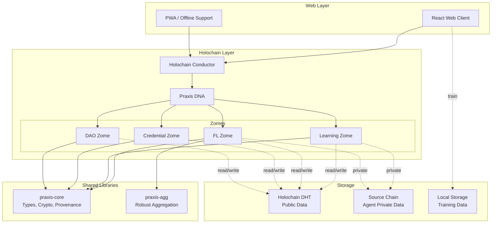
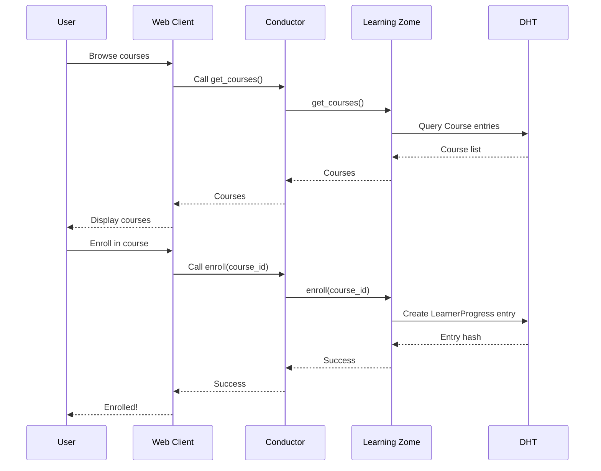
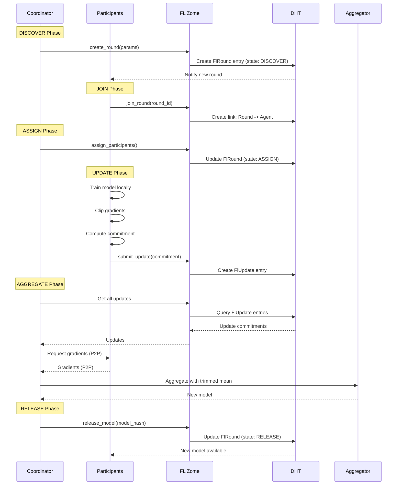
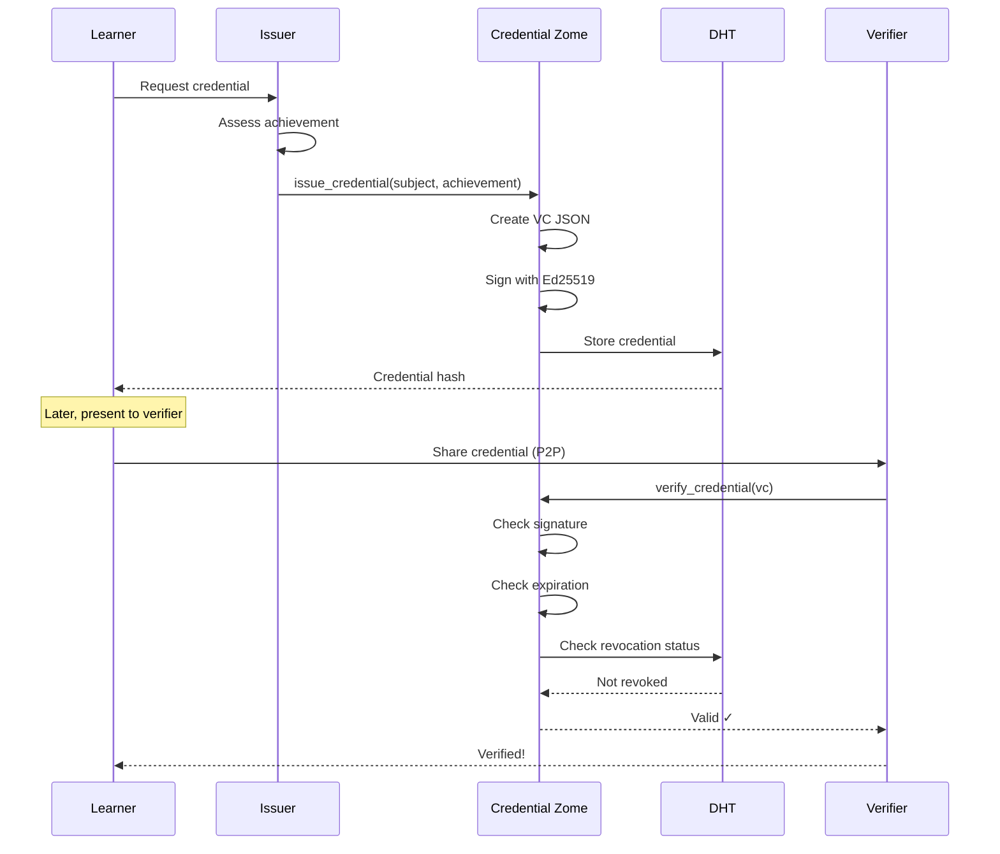
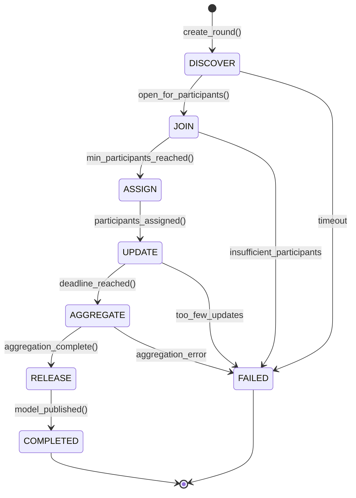

# Praxis Architecture

This document provides a comprehensive overview of the Mycelix Praxis architecture.

## Table of Contents

- [High-Level Architecture](#high-level-architecture)
- [Component Architecture](#component-architecture)
- [Data Flow](#data-flow)
- [FL Round Lifecycle](#fl-round-lifecycle)
- [Deployment Architecture](#deployment-architecture)
- [Technology Stack](#technology-stack)

---

## High-Level Architecture



---

## Component Architecture

### Apps Layer

```
apps/web/
├── src/
│   ├── components/       # React components
│   │   ├── courses/      # Course UI
│   │   ├── fl/           # FL round UI
│   │   ├── credentials/  # VC UI
│   │   └── dao/          # Governance UI
│   ├── services/         # Holochain client integration
│   │   ├── conductor.ts  # Conductor connection
│   │   └── zome-calls.ts # Zome function wrappers
│   ├── stores/           # State management
│   └── App.tsx           # Main app
└── package.json
```

### Rust Crates

```
crates/
├── praxis-core/
│   ├── src/
│   │   ├── types.rs      # RoundId, ModelId, PrivacyParams
│   │   ├── crypto.rs     # BLAKE3 hashing, commitments
│   │   └── provenance.rs # ModelProvenance, ProvenanceChain
│   └── Cargo.toml
└── praxis-agg/
    ├── src/
    │   ├── methods.rs    # trimmed_mean, median, weighted_mean
    │   └── errors.rs     # AggregationError
    └── Cargo.toml
```

### Holochain Zomes

```
zomes/
├── learning_zome/        # Courses, progress, activities
├── fl_zome/              # FL rounds, updates, aggregation
├── credential_zome/      # W3C VCs, issuance, verification
└── dao_zome/             # Proposals, votes, governance
```

---

## Data Flow

### Course Enrollment Flow



### FL Round Lifecycle Flow



### Credential Issuance Flow



---

## FL Round Lifecycle

### State Transitions



### Timeline

```
Time  →
0h    │ DISCOVER: Round announced
      │ Participants can join
      │
24h   │ JOIN: Min participants reached
      │ Coordinator assigns tasks
      │
30h   │ ASSIGN: Base model distributed
      │ Participants train locally
      │
78h   │ UPDATE: Participants submit commitments
      │ Deadline for submissions
      │
80h   │ AGGREGATE: Coordinator requests gradients (P2P)
      │ Applies trimmed mean
      │
82h   │ RELEASE: New model published
      │ Provenance entry created
      │
      ▼ COMPLETED
```

---

## Deployment Architecture

### Local Development

```
┌─────────────────────────────────────┐
│        Developer Machine            │
│                                     │
│  ┌─────────────────────────────┐   │
│  │   Web Client (Vite dev)     │   │
│  │   localhost:3000            │   │
│  └──────────┬──────────────────┘   │
│             │                       │
│  ┌──────────▼──────────────────┐   │
│  │  Holochain Conductor        │   │
│  │  (hc sandbox)               │   │
│  │  - Praxis DNA loaded        │   │
│  │  - Agent key generated      │   │
│  └─────────────────────────────┘   │
│                                     │
│  Local file system:                 │
│  - Source chain DB                  │
│  - DHT shard                        │
│  - Training data (private)          │
└─────────────────────────────────────┘
```

### Multi-Agent Network (Testing)

```
┌──────────┐    ┌──────────┐    ┌──────────┐
│ Agent 1  │    │ Agent 2  │    │ Agent 3  │
│ (Coord.) │    │ (Learner)│    │ (Learner)│
├──────────┤    ├──────────┤    ├──────────┤
│Conductor │◄───┤Conductor │◄───┤Conductor │
│  :8888   │    │  :8889   │    │  :8890   │
└─────┬────┘    └─────┬────┘    └─────┬────┘
      │               │               │
      └───────────────┴───────────────┘
                      │
             ┌────────▼─────────┐
             │  Bootstrap Node  │
             │  (network entry) │
             └──────────────────┘
```

### Production (Future)

```
┌──────────────────────────────────────────┐
│              CDN / Edge                  │
│       (Static web client assets)         │
└───────────────┬──────────────────────────┘
                │
┌───────────────▼──────────────────────────┐
│         User Devices                     │
│  (Holochain conductor + web client)      │
│                                          │
│  - Install hApp from hApp store          │
│  - Connect to bootstrap nodes            │
│  - Join DHT network                      │
│  - Participate in FL rounds              │
└──────────────────────────────────────────┘
                │
┌───────────────▼──────────────────────────┐
│       Holochain Network                  │
│  - Distributed Hash Table (DHT)          │
│  - Peer-to-peer connections              │
│  - No central server                     │
└──────────────────────────────────────────┘
```

---

## Technology Stack

### Frontend
- **React 18**: UI framework
- **TypeScript**: Type safety
- **Vite**: Fast build tooling
- **@holochain/client**: Conductor communication
- **React Router**: Navigation
- **PWA**: Offline support

### Backend (Holochain)
- **Holochain**: Distributed application framework
- **Rust**: Systems programming for zomes
- **WASM**: Zome compilation target
- **DHT**: Distributed data storage
- **Ed25519**: Digital signatures

### Libraries
- **praxis-core**: Core types, crypto, provenance
- **praxis-agg**: Robust aggregation algorithms
- **BLAKE3**: Cryptographic hashing
- **serde**: Serialization/deserialization

### Infrastructure
- **GitHub Actions**: CI/CD
- **Docker** (future): Containerization
- **IPFS** (future): Model storage

---

## Scalability Considerations

### DHT Sharding

Each agent stores a shard of the DHT based on:
- **Entry hash**: Deterministic routing
- **Agent capacity**: Storage and bandwidth limits
- **Redundancy**: Multiple agents per entry (configurable)

### FL Scalability

- **Participants per round**: 10-1000 (tested up to 100 in simulation)
- **Gradient size**: Varies by model (typically 1-100 MB per update)
- **Aggregation time**: O(n * d) where n = participants, d = model dimensions
- **Network overhead**: P2P gradient transfer reduces coordinator bottleneck

### Performance Targets

| Metric | Target (v0.1) | Target (v1.0) |
|--------|---------------|---------------|
| Web client load time | <3s | <1s |
| Zome call latency | <500ms | <200ms |
| DHT query latency | <1s | <500ms |
| FL round duration | 24-48h | 12-24h |
| Participants per round | 10-100 | 100-1000 |

---

## Security Architecture

### Trust Boundaries

```
┌──────────────────────────────────────────┐
│         Trusted                          │
│  - Agent's local source chain            │
│  - Agent's private training data         │
│  - Agent's signing keys (lair keystore)  │
└──────────────────────────────────────────┘

┌──────────────────────────────────────────┐
│         Semi-Trusted                     │
│  - FL round coordinator (elected by DAO) │
│  - Credential issuers (curated list)     │
│  - Other participants (reputation-based) │
└──────────────────────────────────────────┘

┌──────────────────────────────────────────┐
│         Untrusted                        │
│  - Public DHT data (validate everything) │
│  - Network traffic (encrypted via TLS)   │
│  - External APIs (future: oracles, etc.) │
└──────────────────────────────────────────┘
```

### Cryptographic Primitives

- **Hashing**: BLAKE3 (commitment, provenance)
- **Signatures**: Ed25519 (Holochain agent keys)
- **Key management**: Lair keystore (secure enclave)
- **Commitments**: Hash-based (gradients, credentials)

---

## Next Steps

- [ ] Add sequence diagrams for DAO governance
- [ ] Add deployment diagrams for cloud + edge
- [ ] Add performance benchmarks
- [ ] Add monitoring and observability architecture

See [IMPROVEMENT_PLAN.md](IMPROVEMENT_PLAN.md) for full roadmap.
