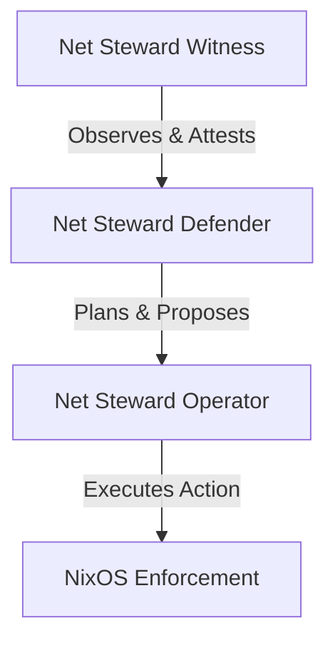

# Net Steward Security Architecture & Witness Layers

This document outlines the architectural boundaries and claims verification limits of the Net Steward infrastructure assurance module.

## The Three Product Layers

Net Steward defines a strict separation of concerns across three product layers:

### 1. Net Steward Witness
* **Role**: Observes topology, config drift, systemd configuration, network sockets, active users, and system postures.
* **Privileges**: Strictly **read-only**. Runs with minimal system privileges.
* **Claims**: Evaluates safety assertions and commitments using local "simulated envelopes". Does not execute autonomous blocklists, kernel mitigations, or process terminations.

### 2. Net Steward Defender (Planned Module)
* **Role**: Plans safe container/interface isolation, rollback instructions, and user confirmation envelopes.
* **Privileges**: Restricted planning engine. Does not run active remediation itself; instead, it outputs signed execution and rollback receipts.

### 3. Net Steward Operator (Future Integration)
* **Role**: Executes operator-approved actions safely using NixOS Rollbacks and Mycelix/Xenia capability contexts.
* **Privileges**: Requires cryptographic operator signatures and verification before execution.

---

## Safety & Credibility Doctrine (No-False-EDR Claims)

To maintain credibility and avoid noisy security alerts:
1. **No Autonomous EDR claims**: We do not claim to block malware, isolate network interfaces automatically, kill running processes, or remove ransomware in the background.
2. **No Kernel Hooks**: Posture telemetry is collected using unprivileged standard Linux filesystems (`/proc`, `/etc`) and command utilities.
3. **Evidence-Centricity**: Every system anomaly is flagged as an "unexpected deviation" from the declared NixOS/Mycelix baseline rather than asserting definitive malice.
